# Расчётное задание 2a (Статическая обработка случайный последовательностей. Идентификация законов распределения)
- **Студент:** Сыров Егор Романович
- **Группа:** 5130901/30201

## Задание 1: Статистическая обработка случайных последовательностей

### 1.1: Создать 10 подвыборок


```python
import numpy as np
import matplotlib.pyplot as plt
import scipy
import pandas as pd
import seaborn as sns
from scipy import stats

with open("Task_2a.txt", "r") as file:
    N = int(file.readline())
    X = np.array(tuple(map(float, file.readline().split())))

np.random.seed(42)
Xperm = np.random.permutation(X)
Xpodv = np.split(Xperm, 10)
Xpodv_sorted = [np.sort(podv) for podv in Xpodv]
```

### 1.2: Представить визуально оценки функции плотности распределения

### 1.2.1: Выборочная функция распределния F(x)


```python
fig, ax = plt.subplots(2, 5, figsize=(10, 8))
fig.suptitle("Выборочные функции распределений")
for index, podv in enumerate(Xpodv_sorted):
    res = scipy.stats.ecdf(podv)
    ax[index // 5, index % 5].step(res.cdf.quantiles, res.cdf.probabilities, where='post')
    ax[index // 5, index % 5].set_title(f"podv[{index + 1}]")    
```


    
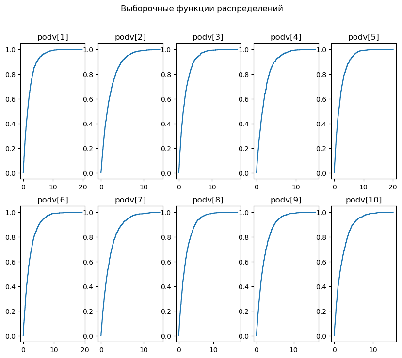
    


### 1.2.2: Абсолютные и относительные гистограммы распределений


```python
fig, ax = plt.subplots(2, 5, figsize=(10, 8))
fig.suptitle("Абсолютные гистограммы распределений")
for index, podv in enumerate(Xpodv_sorted):
    counts, bin_edges = np.histogram(podv[:-60], bins="fd")
    ax[index // 5, index % 5].bar(bin_edges[:-1], counts, width=np.diff(bin_edges), alpha=0.7, edgecolor='black')
    ax[index // 5, index % 5].set_title(f"podv[{index + 1}]")

fig, ax = plt.subplots(2, 5, figsize=(10, 8))
fig.suptitle("Относительные гистограммы распределений")
for index, podv in enumerate(Xpodv_sorted): 
    counts, bin_edges = np.histogram(podv[:-60], bins="fd")
    ax[index // 5, index % 5].bar(bin_edges[:-1], counts / len(podv[:-60]), width=np.diff(bin_edges), alpha=0.7, edgecolor='black')
    ax[index // 5, index % 5].set_title(f"podv[{index + 1}]")
```


    

    


    
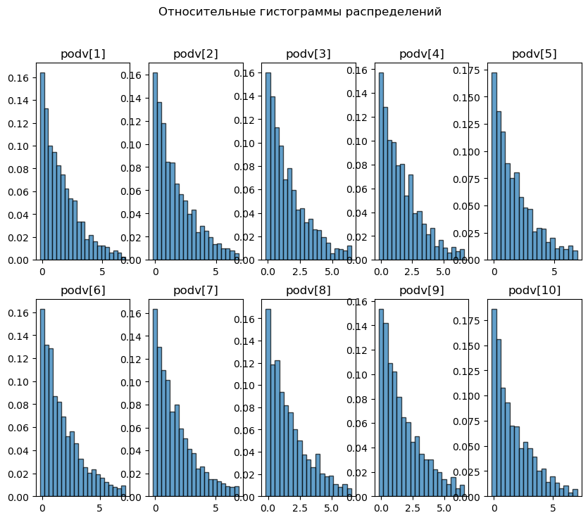
    


### 1.2.3: Оценки плотности распределений с применением ядерного оценивания

**Функции ядер**


```python
# Прямоугольное (равномерное ядро)
def uniform_kernel(u):
    return np.where(np.abs(u) < 0.5, 1.0, 0.0)

# Гауссово ядро
def gaussian_kernel(u):
    return np.exp(-0.5 * u**2) / np.sqrt(2 * np.pi)

# Экспоненциальное ядро (Лапласа)
def laplas_kernel(u):
    return 1 / 2 * np.exp(-np.abs(u))

# Ядро Коши
def koshi_kernel(u):
    return 1 / np.pi / (1 + u**2)

# Треугольное ядро
def triangle_kernel(u):
    return np.where(np.abs(u) < 1, 1 - np.abs(u), 0)

# Восстанавливающий фильтр
def restorative_filter(u):
    return 1 / (2 * np.pi) * (np.sin(u / 2) / (u / 2))**2
```

**Ядерная оценка плотности для различных ядер**


```python
# Ядерная оценка плотности в точке x
def kernel_density(x, data, h, kernel_func):
    n = len(data)
    result = 0.0
    for xi in data:
        result += kernel_func((x - xi) / h)
    return result / (n * h)

# Параметрический выбор оптимального значения h (предположительно имеем дело с распределением Рэлея)
def optimal_h(data, kernel_type='gaussian'):
    N = len(data)
    mean = np.mean(data)
    var = np.var(data)
    
    sigma_rayleigh = mean / np.sqrt(np.pi/2)
    
    Q1 = sigma_rayleigh * np.sqrt(-2 * np.log(0.75))
    Q3 = sigma_rayleigh * np.sqrt(-2 * np.log(0.25))
    IQR = Q3 - Q1
    
    h_opt1 = 1.06 * sigma_rayleigh * N**(-0.2)
    
    A = min(sigma_rayleigh, IQR/1.34)
    h_opt2 = 0.9 * A * N**(-0.2)
    
    return h_opt1, h_opt2

# Построение ядерных оценок с оптимальными h
def plot_kde(data, title=""):
    
    kernels = [
        ('Прямоугольное', uniform_kernel),
        ('Гауссово', gaussian_kernel),
        ('Лапласа', laplas_kernel),
        ('Коши', koshi_kernel)
    ]
    
    h_opt1, h_opt2 = optimal_h(data)
    
    fig, axes = plt.subplots(2, 2, figsize=(15, 10))
    axes = axes.ravel()
    
    for idx, (kernel_name, kernel_func) in enumerate(kernels):
        ax = axes[idx]
        
        ax.hist(data, bins=15, density=True, alpha=0.3, color='gray', label='Гистограмма')
        
        density_opt1 = np.array([kernel_density(x, data, h_opt1, kernel_func) for x in data])
        density_opt2 = np.array([kernel_density(x, data, h_opt2, kernel_func) for x in data])
        
        ax.plot(data, density_opt1, 'r-', linewidth=2, label=f'h_opt1={h_opt1:.3f}')
        ax.plot(data, density_opt2, 'b-', linewidth=2, label=f'h_opt2={h_opt2:.3f}')
        
        ax.set_title(f'{kernel_name} ядро')
        ax.set_xlabel('x')
        ax.set_ylabel('Плотность')
        ax.legend()
        ax.grid(True, alpha=0.3)
    
    plt.suptitle(f'Ядерные оценки плотности {title}\n(предположение: распределение Релея)')
    plt.tight_layout()
    plt.show()
    
    return h_opt1, h_opt2

for i, podv in enumerate(Xpodv_sorted):
    print(f"\nПодвыборка {i+1}:")
    plot_kde(podv, f"podv[{i+1}]")
```

    
    Подвыборка 1:


    

    


    
    Подвыборка 2:


    
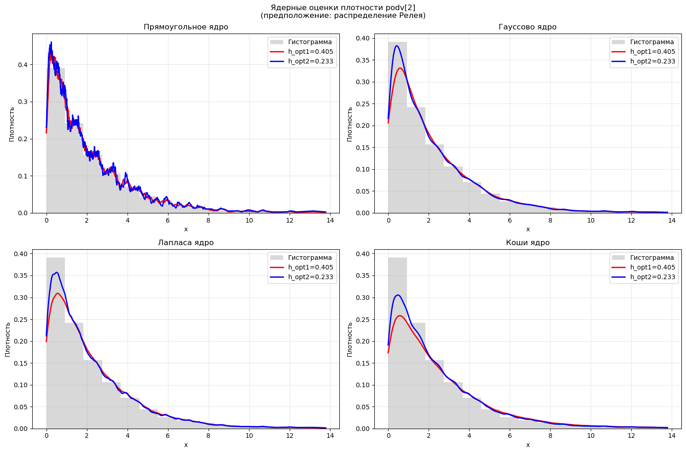
    


    
    Подвыборка 3:


    
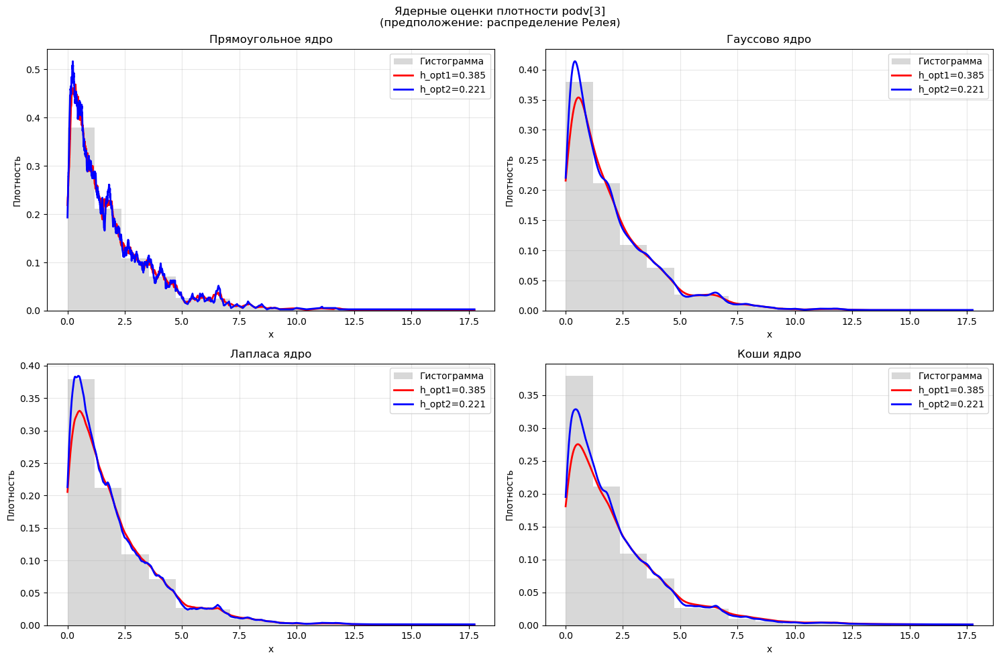
    


    
    Подвыборка 4:


    

    


    
    Подвыборка 5:


    

    


    
    Подвыборка 6:


    
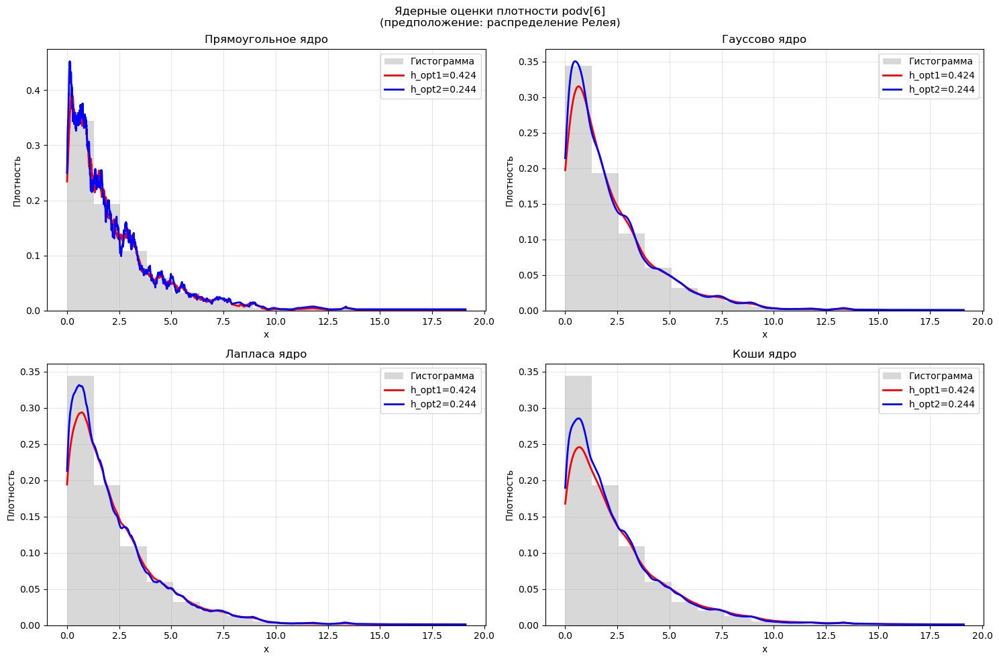
    


    
    Подвыборка 7:


    

    


    
    Подвыборка 8:


    
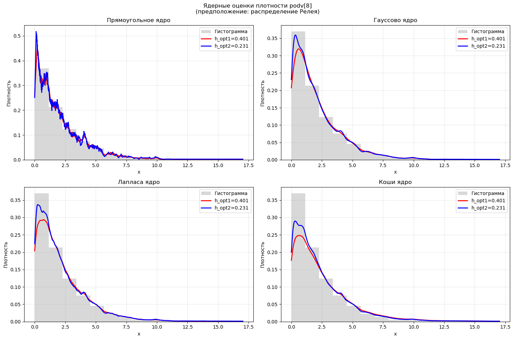
    


    
    Подвыборка 9:


    
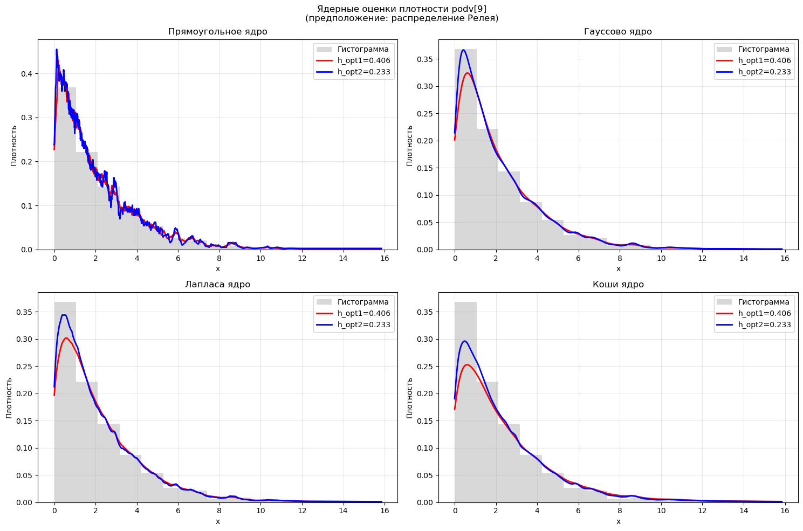
    


    
    Подвыборка 10:


    

    


## Определение точечных оценок
### Точечные оценки моментов (первого начального, центрального момента (2-гоб 3-го и 4-го порядков))


```python
# Оценка Математического ожидания
mean = np.mean(Xperm)
median = np.median(Xperm)
min_max_mean = (np.min(Xperm) + np.max(Xperm)) / 2
counts, bin_edges = np.histogram(Xperm, bins='auto')
max_count_idx = np.argmax(counts)
mode_bin_center = (bin_edges[max_count_idx] + bin_edges[max_count_idx + 1]) / 2
mode_value = counts[max_count_idx]


mean_per_podv = np.mean(Xpodv, axis=1)
median_per_podv = np.median(Xpodv, axis=1)
min_per_podv = np.min(Xpodv, axis=1)
max_per_podv = np.max(Xpodv, axis=1)
min_max_mean_per_podv = (min_per_podv + max_per_podv) / 2

print("Оценка математического ожидания:")
print(f"All data: mean={mean:.4f}, median={median:.4f}, min_max_mean={min_max_mean:.4f}, mode={mode_value:.4f}")
for idx, (mean, median, min_max_mean) in enumerate(zip(mean_per_podv, median_per_podv, min_max_mean_per_podv)):
    counts, bin_edges = np.histogram(Xpodv_sorted[idx], bins='auto')
    max_count_idx = np.argmax(counts)
    mode_bin_center = (bin_edges[max_count_idx] + bin_edges[max_count_idx + 1]) / 2
    mode_value = counts[max_count_idx]

    print(f"podv[{idx+1}]: mean={mean:.4f}, median={median:.4f}, min_max_mean={min_max_mean:.4f}, mode={mode_value:.4f}")

print()
print("Оценка Дисперсии, 3-го центрального момента, 4-го центрального момента, оценка асимметрии, эксцесса")
variance = np.var(Xperm, ddof=1)
moment_3 = scipy.stats.moment(Xperm, moment=3)
moment_4 = scipy.stats.moment(Xperm, moment=4)
skewness = scipy.stats.skew(Xperm)
kurtosis = scipy.stats.kurtosis(Xperm)

print(f"All data: var={variance:.4f}, moment_3={moment_3:.4f}, moment_4={moment_4:.4f}, skewness={skewness:.4f}, kurtosis={kurtosis:.4f}")

# Оценка Дисперсии (3-го центрального момента, 4-го центрального момента) + оценка асимметрии и эксцесса
for idx, data in enumerate(Xpodv_sorted):
    variance = np.var(data, ddof=1) # Дисперсия несмещенная
    moment_3 = scipy.stats.moment(data, moment=3)
    moment_4 = scipy.stats.moment(data, moment=4)

    skewness = scipy.stats.skew(data)
    kurtosis = scipy.stats.kurtosis(data)

    print(f"podv[{idx+1}]: var={variance:.4f}, moment_3={moment_3:.4f}, moment_4={moment_4:.4f}, skewness={skewness:.4f}, kurtosis={kurtosis:.4f}")
```

    Оценка математического ожидания:
    All data: mean=2.1000, median=1.4678, min_max_mean=10.0366, mode=1396.0000
    podv[1]: mean=2.0406, median=1.4468, min_max_mean=9.8939, mode=285.0000
    podv[2]: mean=2.1104, median=1.4708, min_max_mean=6.8892, mode=282.0000
    podv[3]: mean=2.0079, median=1.3850, min_max_mean=8.8775, mode=283.0000
    podv[4]: mean=2.0587, median=1.4918, min_max_mean=7.4563, mode=263.0000
    podv[5]: mean=2.1580, median=1.5027, min_max_mean=10.0373, mode=292.0000
    podv[6]: mean=2.2104, median=1.5386, min_max_mean=9.5533, mode=276.0000
    podv[7]: mean=2.1134, median=1.4520, min_max_mean=6.9338, mode=286.0000
    podv[8]: mean=2.0906, median=1.4922, min_max_mean=8.5124, mode=284.0000
    podv[9]: mean=2.1145, median=1.4767, min_max_mean=7.9230, mode=272.0000
    podv[10]: mean=2.0957, median=1.4292, min_max_mean=7.5939, mode=319.0000
    
    Оценка Дисперсии, 3-го центрального момента, 4-го центрального момента, оценка асимметрии, эксцесса
    All data: var=4.4112, moment_3=18.4789, moment_4=172.6759, skewness=1.9947, kurtosis=5.8750
    podv[1]: var=4.2773, moment_3=19.4859, moment_4=194.5792, skewness=2.2047, kurtosis=7.6482
    podv[2]: var=4.3424, moment_3=16.4573, moment_4=136.9053, skewness=1.8203, kurtosis=4.2691
    podv[3]: var=4.0998, moment_3=17.1131, moment_4=157.4974, skewness=2.0633, kurtosis=6.3813
    podv[4]: var=4.0236, moment_3=15.5439, moment_4=132.6265, skewness=1.9277, kurtosis=5.2021
    podv[5]: var=4.7204, moment_3=21.5172, moment_4=233.8324, skewness=2.1000, kurtosis=7.5070
    podv[6]: var=5.0642, moment_3=23.6760, moment_4=242.0329, skewness=2.0794, kurtosis=6.4489
    podv[7]: var=4.4847, moment_3=18.1664, moment_4=154.8535, skewness=1.9145, kurtosis=4.7086
    podv[8]: var=4.2669, moment_3=17.2754, moment_4=158.4375, skewness=1.9618, kurtosis=5.7128
    podv[9]: var=4.3199, moment_3=17.1712, moment_4=153.5677, skewness=1.9142, kurtosis=5.2389
    podv[10]: var=4.5070, moment_3=17.9551, moment_4=157.9800, skewness=1.8783, kurtosis=4.7868


### 1.3.3: Оценка границ интерквантильногро промежутка $J_P$ для $P = 0.95$ для полной выборки


```python
alpha = 0.05
lower_quantile = alpha / 2
upper_quantile = 1 - alpha / 2

Q_lower = np.quantile(Xperm, lower_quantile)
Q_upper = np.quantile(Xperm, upper_quantile)

IQR_95 = Q_upper - Q_lower
print("95% ИНТЕРКВАНТИЛЬНЫЙ ПРОМЕЖУТОК:")
print("=" * 50)
print(f"2.5% квантиль (нижняя граница): {Q_lower:.6f}")
print(f"97.5% квантиль (верхняя граница): {Q_upper:.6f}")
print(f"95% интерквантильный промежуток: {IQR_95:.6f}")
```

    95% ИНТЕРКВАНТИЛЬНЫЙ ПРОМЕЖУТОК:
    ==================================================
    2.5% квантиль (нижняя граница): 0.052691
    97.5% квантиль (верхняя граница): 7.746544
    95% интерквантильный промежуток: 7.693853


### 1.3.4: Таблица с результатами


```python
columns = ['N', 'X', 'X_med', 'X_cp', 's^2', 's', 'm_3', 'm_4', 'As', 'Ex']
data = []

data.append([
    'N',
    f"{2.1000:.4f}",  # X (mean)
    f"{1.4678:.4f}",  # X_med (median)
    f"{10.0366:.4f}", # X_cp (min_max_mean)
    f"{4.4112:.4f}",  # s^2 (variance)
    f"{np.sqrt(4.4112):.4f}",  # s (std) - вычисляем из дисперсии
    f"{18.4789:.4f}", # m_3
    f"{172.6759:.4f}", # m_4
    f"{1.9947:.4f}",  # As (skewness)
    f"{5.8750:.4f}"   # Ex (kurtosis)
])

podv_data = [
    # [mean, median, min_max_mean, variance, moment_3, moment_4, skewness, kurtosis]
    [2.0406, 1.4468, 9.8939, 4.2773, 19.4859, 194.5792, 2.2047, 7.6482],
    [2.1104, 1.4708, 6.8892, 4.3424, 16.4573, 136.9053, 1.8203, 4.2691],
    [2.0079, 1.3850, 8.8775, 4.0998, 17.1131, 157.4974, 2.0633, 6.3813],
    [2.0587, 1.4918, 7.4563, 4.0236, 15.5439, 132.6265, 1.9277, 5.2021],
    [2.1580, 1.5027, 10.0373, 4.7204, 21.5172, 233.8324, 2.1000, 7.5070],
    [2.2104, 1.5386, 9.5533, 5.0642, 23.6760, 242.0329, 2.0794, 6.4489],
    [2.1134, 1.4520, 6.9338, 4.4847, 18.1664, 154.8535, 1.9145, 4.7086],
    [2.0906, 1.4922, 8.5124, 4.2669, 17.2754, 158.4375, 1.9618, 5.7128],
    [2.1145, 1.4767, 7.9230, 4.3199, 17.1712, 153.5677, 1.9142, 5.2389],
    [2.0957, 1.4292, 7.5939, 4.5070, 17.9551, 157.9800, 1.8783, 4.7868]
]

for i, podv in enumerate(podv_data, 1):
    data.append([
        f'N/10_{i}',
        f"{podv[0]:.4f}",  # X (mean)
        f"{podv[1]:.4f}",  # X_med (median)
        f"{podv[2]:.4f}",  # X_cp (min_max_mean)
        f"{podv[3]:.4f}",  # s^2 (variance)
        f"{np.sqrt(podv[3]):.4f}",  # s (std) - вычисляем из дисперсии
        f"{podv[4]:.4f}",  # m_3
        f"{podv[5]:.4f}",  # m_4
        f"{podv[6]:.4f}",  # As (skewness)
        f"{podv[7]:.4f}"   # Ex (kurtosis)
    ])

df = pd.DataFrame(data, columns=columns)

from IPython.display import display, Markdown

display(Markdown("### Результаты статистического анализа"))
display(Markdown(df.to_markdown(index=False)))
```


### Результаты статистического анализа


| N       |      X |   X_med |    X_cp |    s^2 |      s |     m_3 |     m_4 |     As |     Ex |
|:--------|-------:|--------:|--------:|-------:|-------:|--------:|--------:|-------:|-------:|
| N       | 2.1    |  1.4678 | 10.0366 | 4.4112 | 2.1003 | 18.4789 | 172.676 | 1.9947 | 5.875  |
| N/10_1  | 2.0406 |  1.4468 |  9.8939 | 4.2773 | 2.0682 | 19.4859 | 194.579 | 2.2047 | 7.6482 |
| N/10_2  | 2.1104 |  1.4708 |  6.8892 | 4.3424 | 2.0838 | 16.4573 | 136.905 | 1.8203 | 4.2691 |
| N/10_3  | 2.0079 |  1.385  |  8.8775 | 4.0998 | 2.0248 | 17.1131 | 157.497 | 2.0633 | 6.3813 |
| N/10_4  | 2.0587 |  1.4918 |  7.4563 | 4.0236 | 2.0059 | 15.5439 | 132.626 | 1.9277 | 5.2021 |
| N/10_5  | 2.158  |  1.5027 | 10.0373 | 4.7204 | 2.1726 | 21.5172 | 233.832 | 2.1    | 7.507  |
| N/10_6  | 2.2104 |  1.5386 |  9.5533 | 5.0642 | 2.2504 | 23.676  | 242.033 | 2.0794 | 6.4489 |
| N/10_7  | 2.1134 |  1.452  |  6.9338 | 4.4847 | 2.1177 | 18.1664 | 154.853 | 1.9145 | 4.7086 |
| N/10_8  | 2.0906 |  1.4922 |  8.5124 | 4.2669 | 2.0656 | 17.2754 | 158.438 | 1.9618 | 5.7128 |
| N/10_9  | 2.1145 |  1.4767 |  7.923  | 4.3199 | 2.0784 | 17.1712 | 153.568 | 1.9142 | 5.2389 |
| N/10_10 | 2.0957 |  1.4292 |  7.5939 | 4.507  | 2.123  | 17.9551 | 157.98  | 1.8783 | 4.7868 |


### 1.3.4: Представление результатов графически


```python
categories = ['N'] + [f'N/10_{i}' for i in range(1, 11)]

means = [2.1000, 2.0406, 2.1104, 2.0079, 2.0587, 2.1580, 2.2104, 2.1134, 2.0906, 2.1145, 2.0957]
medians = [1.4678, 1.4468, 1.4708, 1.3850, 1.4918, 1.5027, 1.5386, 1.4520, 1.4922, 1.4767, 1.4292]
min_max_means = [10.0366, 9.8939, 6.8892, 8.8775, 7.4563, 10.0373, 9.5533, 6.9338, 8.5124, 7.9230, 7.5939]

variances = [4.4112, 4.2773, 4.3424, 4.0998, 4.0236, 4.7204, 5.0642, 4.4847, 4.2669, 4.3199, 4.5070]
std_devs = [np.sqrt(v) for v in variances]
moments_3 = [18.4789, 19.4859, 16.4573, 17.1131, 15.5439, 21.5172, 23.6760, 18.1664, 17.2754, 17.1712, 17.9551]
moments_4 = [172.6759, 194.5792, 136.9053, 157.4974, 132.6265, 233.8324, 242.0329, 154.8535, 158.4375, 153.5677, 157.9800]
skewness = [1.9947, 2.2047, 1.8203, 2.0633, 1.9277, 2.1000, 2.0794, 1.9145, 1.9618, 1.9142, 1.8783]
kurtosis = [5.8750, 7.6482, 4.2691, 6.3813, 5.2021, 7.5070, 6.4489, 4.7086, 5.7128, 5.2389, 4.7868]

fig, axes = plt.subplots(2, 3, figsize=(18, 12))
fig.suptitle('Графическое представление статистических характеристик', fontsize=16)

# 1. Оценки математического ожидания
axes[0, 0].plot(categories, means, 'bo-', label='Среднее (X)', markersize=6)
axes[0, 0].plot(categories, medians, 'ro-', label='Медиана (X_med)', markersize=6)
axes[0, 0].plot(categories, min_max_means, 'go-', label='Min-Max среднее (X_cp)', markersize=6)
axes[0, 0].set_title('Оценки математического ожидания')
axes[0, 0].set_ylabel('Значение')
axes[0, 0].set_xlabel('Выборка')
axes[0, 0].legend()
axes[0, 0].grid(True, alpha=0.3)
axes[0, 0].tick_params(axis='x', rotation=45)

# 2. Дисперсия и стандартное отклонение
axes[0, 1].plot(categories, variances, 'bo-', label='Дисперсия (s²)', markersize=6)
axes[0, 1].plot(categories, std_devs, 'ro-', label='Стандартное отклонение (s)', markersize=6)
axes[0, 1].set_title('Дисперсия и стандартное отклонение')
axes[0, 1].set_ylabel('Значение')
axes[0, 1].set_xlabel('Выборка')
axes[0, 1].legend()
axes[0, 1].grid(True, alpha=0.3)
axes[0, 1].tick_params(axis='x', rotation=45)

# 3. Центральные моменты
axes[0, 2].plot(categories, moments_3, 'bo-', label='3-й момент (m₃)', markersize=6)
axes[0, 2].plot(categories, moments_4, 'ro-', label='4-й момент (m₄)', markersize=6)
axes[0, 2].set_title('Центральные моменты')
axes[0, 2].set_ylabel('Значение')
axes[0, 2].set_xlabel('Выборка')
axes[0, 2].legend()
axes[0, 2].grid(True, alpha=0.3)
axes[0, 2].tick_params(axis='x', rotation=45)

# 4. Асимметрия и эксцесс
axes[1, 0].plot(categories, skewness, 'bo-', label='Асимметрия (As)', markersize=6)
axes[1, 0].plot(categories, kurtosis, 'ro-', label='Эксцесс (Ex)', markersize=6)
axes[1, 0].set_title('Асимметрия и эксцесс')
axes[1, 0].set_ylabel('Значение')
axes[1, 0].set_xlabel('Выборка')
axes[1, 0].legend()
axes[1, 0].grid(True, alpha=0.3)
axes[1, 0].tick_params(axis='x', rotation=45)

# 5. Сравнение всех оценок мат. ожидания (увеличенный масштаб)
axes[1, 1].plot(categories, means, 'bo-', label='Среднее', markersize=6)
axes[1, 1].plot(categories, medians, 'ro-', label='Медиана', markersize=6)
axes[1, 1].set_title('Сравнение среднего и медианы\n(увеличенный масштаб)')
axes[1, 1].set_ylabel('Значение')
axes[1, 1].set_xlabel('Выборка')
axes[1, 1].legend()
axes[1, 1].grid(True, alpha=0.3)
axes[1, 1].tick_params(axis='x', rotation=45)

# 6. Box plot для визуализации разброса оценок
box_data = [means[1:], medians[1:], min_max_means[1:]]  # Исключаем полную выборку
axes[1, 2].boxplot(box_data, tick_labels=['Среднее', 'Медиана', 'Min-Max среднее'])
axes[1, 2].set_title('Разброс оценок по подвыборкам')
axes[1, 2].set_ylabel('Значение')
axes[1, 2].grid(True, alpha=0.3)

plt.tight_layout()
plt.show()

fig2, axes2 = plt.subplots(1, 2, figsize=(15, 6))

# Точечная диаграмма для средних значений
x_pos = range(len(categories))
axes2[0].scatter(x_pos, means, c='blue', s=80, alpha=0.7, label='Среднее')
axes2[0].scatter(x_pos, medians, c='red', s=80, alpha=0.7, label='Медиана')
axes2[0].set_xticks(x_pos)
axes2[0].set_xticklabels(categories, rotation=45)
axes2[0].set_title('Точечная диаграмма оценок мат. ожидания')
axes2[0].set_ylabel('Значение')
axes2[0].legend()
axes2[0].grid(True, alpha=0.3)

# Точечная диаграмма для моментов
axes2[1].scatter(x_pos, moments_3, c='green', s=80, alpha=0.7, label='3-й момент')
axes2[1].scatter(x_pos, moments_4, c='orange', s=80, alpha=0.7, label='4-й момент')
axes2[1].set_xticks(x_pos)
axes2[1].set_xticklabels(categories, rotation=45)
axes2[1].set_title('Точечная диаграмма центральных моментов')
axes2[1].set_ylabel('Значение')
axes2[1].legend()
axes2[1].grid(True, alpha=0.3)
```


    
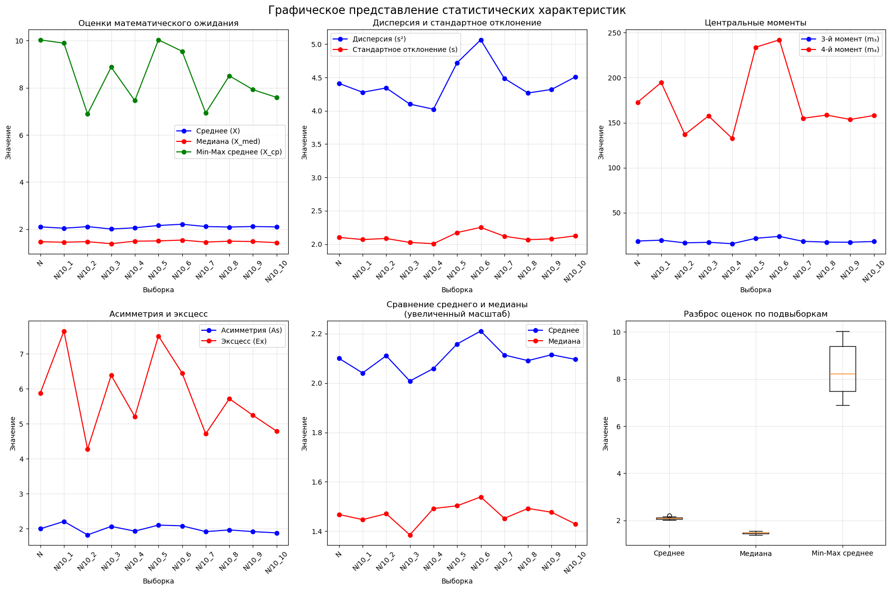
    


    
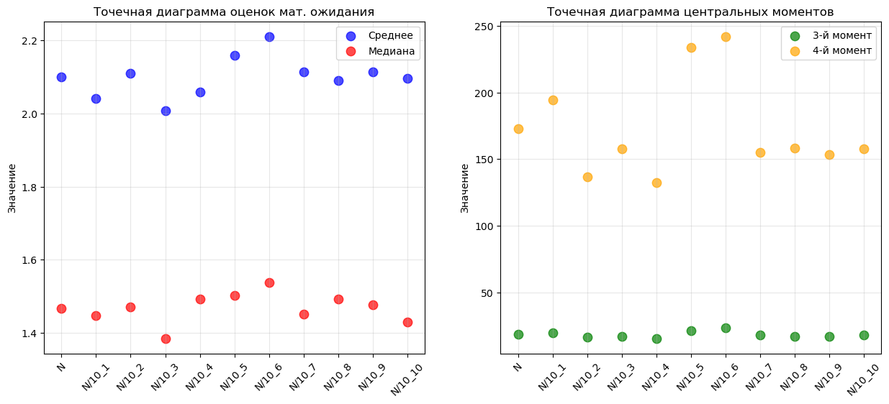
    


## 1.4: Определение интервальных оценок с доверительной вероятностью $Q = 0.8$ интерквантильного промежутка $J_P$ для $P = 0.95$


```python
# Параметры для расчетов
Q_confidence = 0.8   # Доверительная вероятность для интервалов моментов (Q=0.8)
P_coverage = 0.95    # Доля значений, которую должен охватывать толерантный интервал (P=0.95)
Q_tolerance = 0.95   # Доверительная вероятность для толерантных пределов (Q=0.95)

# ========================
# 1. Доверительные интервалы для моментов (Q=0.8)
# ========================

def calculate_moment_intervals(sample, Q):
    """Рассчитывает доверительные интервалы для первого (среднего) и второго (дисперсии) центральных моментов."""
    n = len(sample)          # Объем выборки
    alpha = 1 - Q            # Уровень значимости
    mean = np.mean(sample)   # Выборочное среднее
    std = np.std(sample, ddof=1)  # Выборочное стандартное отклонение (с поправкой Бесселя)

    # Доверительный интервал для среднего арифметического (используется распределение Стьюдента)
    t_val = scipy.stats.t.ppf(1 - alpha/2, df=n-1)  # Квантиль t-распределения
    margin_mean = t_val * std / np.sqrt(n)          # Погрешность для среднего
    ci_mean = (mean - margin_mean, mean + margin_mean)  # Интервал для среднего

    # Доверительный интервал для дисперсии (используется распределение Хи-квадрат)
    chi2_lower = scipy.stats.chi2.ppf(alpha/2, df=n-1)      # Нижняя квантиль хи-квадрат
    chi2_upper = scipy.stats.chi2.ppf(1 - alpha/2, df=n-1)  # Верхняя квантиль хи-квадрат
    var = std**2  # Выборочная дисперсия
    # Интервал для дисперсии: [(n-1)*s^2 / chi2_upper, (n-1)*s^2 / chi2_lower]
    ci_var = ((n-1)*var / chi2_upper, (n-1)*var / chi2_lower)

    return ci_mean, ci_var  # Возвращает пару интервалов: (интервал_среднего, интервал_дисперсии)

# Рассчитываем интервалы для полной выборки Xperm
full_ci_mean, full_ci_var = calculate_moment_intervals(Xperm, Q_confidence)

# Рассчитываем интервалы для каждой из 10 подвыборок
subsample_ci_means = []  # Список для хранения доверительных интервалов среднего
subsample_ci_vars = []   # Список для хранения доверительных интервалов дисперсии
for podv in Xpodv:
    ci_mean, ci_var = calculate_moment_intervals(podv, Q_confidence)
    subsample_ci_means.append(ci_mean)
    subsample_ci_vars.append(ci_var)

# ========================
# 2. Непараметрические толерантные пределы (для полной выборки Xperm)
# ========================

def find_k(N, P, Q_conf):
    """Находит минимальное число k, при котором выполняется неравенство для определения толерантных пределов.
    Используется биномиальное распределение."""
    k = 0
    while True:
        total = 0
        # Суммируем вероятности для всех m от (N-k) до N
        for m in range(N - k, N + 1):
            total += scipy.stats.binom.pmf(m, N, P)  # P(X >= N-k)
        # Если сумма <= 1-Q, то условие выполнено
        if total <= 1 - Q_conf:
            break
        k += 1
    return k

# Расчет толерантных интервалов для полной выборки
N_full = len(Xperm)         # Объем полной выборки
Xperm_sorted = np.sort(Xperm)  # Сортируем выборку по возрастанию
k = find_k(N_full, P_coverage, Q_tolerance)  # Находим k

# Гарантируем, что k >= 1, чтобы избежать ошибки индексации
k = max(1, k)

# Толерантный интервал, симметричный относительно среднего арифметического
if k % 2 == 0:
    # Для четного k: исключаем k/2 элементов слева и k/2 справа
    lower_1based = k // 2     # Номер нижнего порядкового статистика (1-based)
    upper_1based = N_full - k // 2  # Номер верхнего порядкового статистика (1-based)
else:
    # Для нечетного k: исключаем (k-1)/2 элементов слева и справа
    lower_1based = (k - 1) // 2
    upper_1based = N_full - (k - 1) // 2

# Преобразуем 1-based индексы в 0-based и ограничиваем их допустимым диапазоном [0, N_full-1]
lower_idx = max(0, min(N_full - 1, lower_1based - 1))
upper_idx = max(0, min(N_full - 1, upper_1based - 1))
tol_interval_sym_mean = (Xperm_sorted[lower_idx], Xperm_sorted[upper_idx])

# Толерантный интервал, симметричный относительно нуля
Xabs = np.abs(Xperm)           # Берем абсолютные значения всех элементов
Xabs_sorted = np.sort(Xabs)    # Сортируем по возрастанию
idx = N_full - k               # Индекс k-го по величине элемента (0-based)
# Интервал: [-|X|_(k), |X|_(k)]
tol_interval_sym_zero = (-Xabs_sorted[idx], Xabs_sorted[idx])

# ========================
# 3. Параметрические толерантные пределы (для частичных выборок Xpodv)
# ========================

def parametric_tolerance_interval(sample, P, Q):
    """Рассчитывает параметрический толерантный интервал, предполагая нормальное распределение.
    Возвращает интервал [mean - k*std, mean + k*std]."""
    n = len(sample)             # Объем подвыборки
    mean = np.mean(sample)      # Выборочное среднее
    std = np.std(sample, ddof=1)  # Выборочное стандартное отклонение

    # Рассчитываем коэффициент k для толерантного интервала
    z_P = scipy.stats.norm.ppf((1 + P)/2)  # Квантиль стандартного нормального распределения для доли P
    chi2_val = scipy.stats.chi2.ppf(1 - Q, df=n-1)  # Квантиль хи-квадрат распределения для доверительной вероятности Q
    # Формула для коэффициента k
    k = z_P * np.sqrt((n-1) / chi2_val * (1 + 1/n))

    # Возвращаем интервал
    return (mean - k*std, mean + k*std)

# Рассчитываем параметрические толерантные интервалы для каждой из 10 подвыборок
parametric_intervals = [parametric_tolerance_interval(podv, P_coverage, Q_tolerance) 
                        for podv in Xpodv]

# ========================
# 4. Визуализация результатов
# ========================

plt.figure(figsize=(14, 10))  # Создаем фигуру размером 14x10 дюймов

# График 1: Доверительные интервалы для среднего
plt.subplot(2, 2, 1)  # Первый подграфик в сетке 2x2
# Отображаем точки (средние) и погрешности (доверительные интервалы)
plt.errorbar(range(11),  # Ось X: индексы (0 - полная выборка, 1-10 - подвыборки)
             [np.mean(Xperm)] + [np.mean(p) for p in Xpodv],  # Значения средних
             yerr=[[np.mean(Xperm) - full_ci_mean[0]] + [np.mean(p) - ci[0] for ci, p in zip(subsample_ci_means, Xpodv)],  # Нижние погрешности
                   [full_ci_mean[1] - np.mean(Xperm)] + [ci[1] - np.mean(p) for ci, p in zip(subsample_ci_means, Xpodv)]],  # Верхние погрешности
             fmt='o', capsize=5, label='Среднее ± ДИ')  # Стиль: точки, "шапочки" погрешностей, легенда
plt.axhline(np.mean(Xperm), color='r', linestyle='--', label='Среднее по полной выборке')  # Горизонтальная линия - среднее по полной выборке
plt.title('Доверительные интервалы для среднего (Q=0.8)')
plt.xlabel('Индекс выборки (0=Полная)')
plt.ylabel('Значение')
plt.legend()  # Показываем легенду

# График 2: Доверительные интервалы для дисперсии
plt.subplot(2, 2, 2)  # Второй подграфик
# Аналогично, но для дисперсии
plt.errorbar(range(11),
             [np.var(Xperm, ddof=1)] + [np.var(p, ddof=1) for p in Xpodv],
             yerr=[[np.var(Xperm, ddof=1) - full_ci_var[0]] + [np.var(p, ddof=1) - ci[0] for ci, p in zip(subsample_ci_vars, Xpodv)],
                   [full_ci_var[1] - np.var(Xperm, ddof=1)] + [ci[1] - np.var(p, ddof=1) for ci, p in zip(subsample_ci_vars, Xpodv)]],
             fmt='s', capsize=5, color='g', label='Дисперсия ± ДИ')
plt.axhline(np.var(Xperm, ddof=1), color='r', linestyle='--', label='Дисперсия по полной выборке')
plt.title('Доверительные интервалы для дисперсии (Q=0.8)')
plt.xlabel('Индекс выборки (0=Полная)')
plt.ylabel('Значение')
plt.legend()

# График 3: Непараметрические толерантные интервалы (для полной выборки)
plt.subplot(2, 2, 3)  # Третий подграфик
# Отображаем интервал, симметричный относительно среднего (синяя линия)
plt.hlines(0, tol_interval_sym_mean[0], tol_interval_sym_mean[1], 
           colors='b', linewidth=5, label='Симметричный относительно среднего')
# Отображаем интервал, симметричный относительно нуля (красная линия)
plt.hlines(0, tol_interval_sym_zero[0], tol_interval_sym_zero[1], 
           colors='r', linewidth=5, label='Симметричный относительно нуля')
# Отмечаем положение выборочного среднего (черная точка)
plt.scatter([np.mean(Xperm)], [0], color='k', zorder=5, label='Выборочное среднее')
plt.title('Непараметрические толерантные интервалы (P=0.95, Q=0.95)')
plt.xlabel('Значение')
plt.legend()

# График 4: Параметрические толерантные интервалы (для подвыборок)
plt.subplot(2, 2, 4)
for i, (podv, interval) in enumerate(zip(Xpodv, parametric_intervals)):
    plt.hlines(i, interval[0], interval[1], colors='c', linewidth=2)
plt.title('Параметрические толерантные интервалы (P=0.95, Q=0.95)')
plt.xlabel('Значение')
plt.yticks(range(10), [f'Подвыборка {i+1}' for i in range(10)])  


# ========================
# 5. Сравнение ширин интервалов
# ========================

print("Сравнение ширины интервалов:")
print(f"Ширина ДИ для среднего (полная выборка): {full_ci_mean[1] - full_ci_mean[0]:.4f}")
print(f"Средняя ширина ДИ для среднего (подвыборки): {np.mean([ci[1]-ci[0] for ci in subsample_ci_means]):.4f}")
print(f"Ширина непараметрического толерантного интервала (симм. относит. среднего): {tol_interval_sym_mean[1] - tol_interval_sym_mean[0]:.4f}")
print(f"Ширина непараметрического толерантного интервала (симм. относит. нуля): {tol_interval_sym_zero[1] - tol_interval_sym_zero[0]:.4f}")
print(f"Средняя ширина параметрического толерантного интервала: {np.mean([ci[1]-ci[0] for ci in parametric_intervals]):.4f}")
```


    
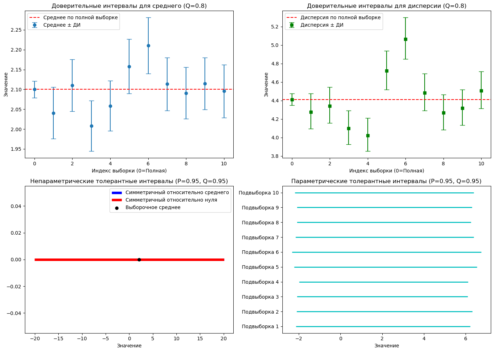
    


    Сравнение ширины интервалов:
    Ширина ДИ для среднего (полная выборка): 0.0418
    Средняя ширина ДИ для среднего (подвыборки): 0.1321
    Ширина непараметрического толерантного интервала (симм. относит. среднего): 20.0731
    Ширина непараметрического толерантного интервала (симм. относит. нуля): 40.1464
    Средняя ширина параметрического толерантного интервала: 8.4731


### Вывод
Анализ полученных результатов показывает принципиальные различия в свойствах доверительных и толерантных интервалов, а также в эффективности параметрических и непараметрических методов. Во-первых, ширина доверительного интервала для среднего по полной выборке (0.0418) значительно меньше, чем средняя ширина таких же интервалов по подвыборкам (0.1321). Это логично, поскольку доверительный интервал оценивает точность оценки параметра (среднего), и его точность напрямую зависит от объема выборки: больший объем (полная выборка) дает более узкий и надежный интервал. Во-вторых, толерантные интервалы, которые предназначены для охвата определенной доли значений генеральной совокупности, существенно шире доверительных интервалов. Ширина непараметрического толерантного интервала, симметричного относительно среднего (20.0731), в несколько раз превышает ширину доверительных интервалов, что объясняется их фундаментально иной задачей — не оценкой параметра, а покрытием части распределения. Интервал, симметричный относительно нуля (40.1464), оказался еще шире, что свидетельствует о том, что распределение данных не центрировано в нуле, и для обеспечения того же охвата P=0.95 при симметрии относительно нуля требуется гораздо больший диапазон. В-третьих, параметрические толерантные интервалы, рассчитанные для подвыборок, имеют среднюю ширину 8.4731, что значительно меньше, чем у непараметрических аналогов. Это является следствием использования дополнительной информации о предполагаемом нормальном распределении данных: параметрический метод более эффективен и дает более узкие интервалы, но его корректность полностью зависит от правильности предположения о законе распределения. Таким образом, можно сделать вывод, что выбор метода расчета интервала должен основываться на конкретной задаче: если нужно оценить точность параметра — используются доверительные интервалы, причем с большими выборками; если нужно гарантировать охват определенной доли значений — применяются толерантные интервалы; и при наличии уверенности в виде распределения — предпочтение отдается более эффективным параметрическим методам, в противном случае — более универсальным, но менее точным непараметрическим.

## 2: Идентификация закона распределения

**Предположительный вид распределения:** Экспоненциальное, Рэлея, Гамма.


```python
# Проверим, есть ли отрицательные значения — для экспоненциального и Рэлея это критично
if np.min(Xperm) < 0:
    print("Предупреждение: данные содержат отрицательные значения.")
    print("   Экспоненциальное и распределение Рэлея определены только для x ≥ 0.")
    print("   Для визуализации сдвинем данные в положительную область.\n")
    X_plot = Xperm - np.min(Xperm) + 1e-10  # Сдвигаем, чтобы все были >0
else:
    X_plot = Xperm.copy()  # Данные уже подходят

# Определяем диапазон для построения PDF
x_min, x_max = np.min(X_plot), np.max(X_plot)
x = np.linspace(x_min, x_max, 1000)

# ========================
# График 1: Экспоненциальное распределение
# ========================
plt.figure(figsize=(8, 5))
plt.hist(X_plot, bins=30, density=True, alpha=0.7, color='lightblue', edgecolor='black', label='Данные')
# Подбираем масштаб (lambda = 1/среднее)
scale_exp = np.mean(X_plot)
pdf_exp = scipy.stats.expon.pdf(x, scale=scale_exp)
plt.plot(x, pdf_exp, 'r-', linewidth=2, label=f'Экспоненциальное (λ={1/scale_exp:.3f})')
plt.title('Гистограмма + Экспоненциальное распределение')
plt.xlabel('Значение')
plt.ylabel('Плотность')
plt.legend()
plt.grid(alpha=0.3)
plt.show()

# ========================
# График 2: Распределение Рэлея
# ========================
plt.figure(figsize=(8, 5))
plt.hist(X_plot, bins=30, density=True, alpha=0.7, color='lightgreen', edgecolor='black', label='Данные')
# Подбираем параметр sigma (sigma = sqrt(дисперсия / 2) или через среднее)
# Для Рэлея: mean = sigma * sqrt(pi/2) => sigma = mean / sqrt(pi/2)
sigma_ray = np.mean(X_plot) / np.sqrt(np.pi / 2)
pdf_ray = scipy.stats.rayleigh.pdf(x, scale=sigma_ray)
plt.plot(x, pdf_ray, 'b-', linewidth=2, label=f'Рэлея (σ={sigma_ray:.3f})')
plt.title('Гистограмма + Распределение Рэлея')
plt.xlabel('Значение')
plt.ylabel('Плотность')
plt.legend()
plt.grid(alpha=0.3)
plt.show()

# ========================
# График 3: Гамма-распределение
# ========================
plt.figure(figsize=(8, 5))
plt.hist(X_plot, bins=30, density=True, alpha=0.7, color='lightcoral', edgecolor='black', label='Данные')
# Подбираем параметры формы (a) и масштаба (scale) через метод моментов
mean_val = np.mean(X_plot)
var_val = np.var(X_plot, ddof=1)
# Для гамма: mean = a * scale, var = a * scale^2 => a = mean^2 / var, scale = var / mean
a_gamma = mean_val**2 / var_val
scale_gamma = var_val / mean_val
pdf_gamma = scipy.stats.gamma.pdf(x, a=a_gamma, scale=scale_gamma)
plt.plot(x, pdf_gamma, 'k-', linewidth=2, label=f'Гамма (a={a_gamma:.3f}, scale={scale_gamma:.3f})')
plt.title('Гистограмма + Гамма-распределение')
plt.xlabel('Значение')
plt.ylabel('Плотность')
plt.legend()
plt.grid(alpha=0.3)
plt.show()
```


    
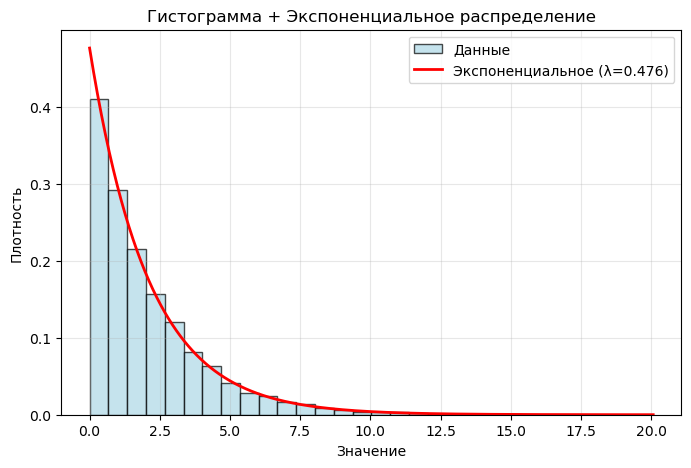
    


    

    


    
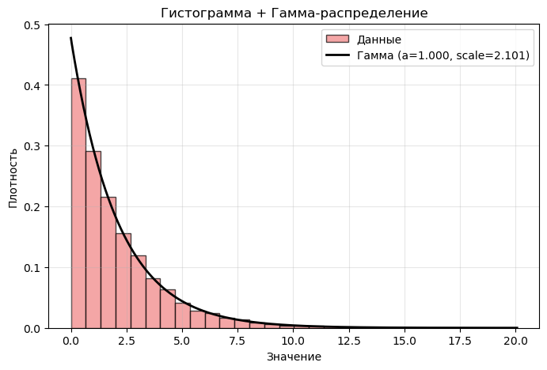
    


## 2.2: Определение теоритических распределений


```python
from scipy.stats import gaussian_kde

# ========================
# Функции для расчета параметров
# ========================

def calculate_moments(data, dist_name):
    """Рассчитывает параметры методом моментов"""
    if dist_name == "Экспоненциальное":
        scale = np.mean(data)
        return {"scale": scale}
    
    elif dist_name == "Рэлея":
        mean = np.mean(data)
        sigma = mean / np.sqrt(np.pi / 2)
        return {"sigma": sigma}
    
    elif dist_name == "Гамма":
        mean = np.mean(data)
        var = np.var(data, ddof=1)
        a = mean**2 / var
        scale = var / mean
        return {"a": a, "scale": scale}

def calculate_mle(data, dist_name):
    """Рассчитывает параметры методом максимального правдоподобия"""
    if dist_name == "Экспоненциальное":
        params = stats.expon.fit(data, floc=0)
        return {"scale": params[1]}
    
    elif dist_name == "Рэлея":
        params = stats.rayleigh.fit(data, floc=0)
        return {"sigma": params[1]}
    
    elif dist_name == "Гамма":
        params = stats.gamma.fit(data, floc=0)
        return {"a": params[0], "scale": params[2]}

# ========================
# Основной цикл по подвыборкам
# ========================

for idx, podv in enumerate(Xpodv):
    data = podv.copy()
    
    # Проверка на отрицательные значения
    if np.min(data) < 0:
        data_shifted = data - np.min(data) + 1e-10
        shifted = True
    else:
        data_shifted = data
        shifted = False
    
    # ========================
    # Вывод информации о подвыборке
    # ========================
    print(f"\n{'='*60}")
    print(f"Анализ подвыборки {idx+1} (размер: {len(data_shifted)} элементов)")
    print(f"Мин: {np.min(data):.4f}, Макс: {np.max(data):.4f}, Среднее: {np.mean(data):.4f}")
    if shifted:
        print("Предупреждение: данные сдвинуты в положительную область для анализа")
    print(f"{'='*60}")
    
    # ========================
    # Анализ для каждого распределения
    # ========================
    for dist_name in ["Экспоненциальное", "Рэлея", "Гамма"]:
        print(f"\n{'-'*50}")
        print(f"Распределение: {dist_name}")
        print(f"{'-'*50}")
        
        # Рассчитываем параметры
        params_mm = calculate_moments(data_shifted, dist_name)
        params_mle = calculate_mle(data_shifted, dist_name)
        
        # Выводим параметры в консоль
        print("Метод моментов:")
        for param, value in params_mm.items():
            print(f"  {param} = {value:.4f}")
        
        print("Метод максимального правдоподобия (ММП):")
        for param, value in params_mle.items():
            print(f"  {param} = {value:.4f}")
        
        # ========================
        # Построение графиков
        # ========================
        
        # Подготовка данных для графиков
        x = np.sort(data_shifted)
        y_empirical = np.arange(1, len(x) + 1) / len(x)
        x_plot = np.linspace(min(data_shifted), max(data_shifted), 1000)
        
        # Определение функций PDF и CDF для текущего распределения
        if dist_name == "Экспоненциальное":
            pdf_mm = stats.expon.pdf(x_plot, scale=params_mm["scale"])
            cdf_mm = stats.expon.cdf(x_plot, scale=params_mm["scale"])
            pdf_mle = stats.expon.pdf(x_plot, scale=params_mle["scale"])
            cdf_mle = stats.expon.cdf(x_plot, scale=params_mle["scale"])
            
        elif dist_name == "Рэлея":
            pdf_mm = stats.rayleigh.pdf(x_plot, scale=params_mm["sigma"])
            cdf_mm = stats.rayleigh.cdf(x_plot, scale=params_mm["sigma"])
            pdf_mle = stats.rayleigh.pdf(x_plot, scale=params_mle["sigma"])
            cdf_mle = stats.rayleigh.cdf(x_plot, scale=params_mle["sigma"])
            
        elif dist_name == "Гамма":
            pdf_mm = stats.gamma.pdf(x_plot, a=params_mm["a"], scale=params_mm["scale"])
            cdf_mm = stats.gamma.cdf(x_plot, a=params_mm["a"], scale=params_mm["scale"])
            pdf_mle = stats.gamma.pdf(x_plot, a=params_mle["a"], scale=params_mle["scale"])
            cdf_mle = stats.gamma.cdf(x_plot, a=params_mle["a"], scale=params_mle["scale"])
        
        # ========================
        # График 1: Функция распределения (CDF)
        # ========================
        plt.figure(figsize=(10, 5))
        
        # Эмпирическая CDF
        plt.step(x, y_empirical, label="Эмпирическая CDF", linewidth=2, color="black")
        
        # Теоретическая CDF (метод моментов)
        plt.plot(x_plot, cdf_mm, label=f"Теоретическая CDF (моменты)", 
                 linestyle="--", linewidth=2, color="blue")
        
        # Теоретическая CDF (ММП)
        plt.plot(x_plot, cdf_mle, label=f"Теоретическая CDF (ММП)", 
                 linestyle="-.", linewidth=2, color="red")
        
        plt.title(f"Функция распределения (CDF) - {dist_name} (Подвыборка {idx+1})")
        plt.xlabel("Значение")
        plt.ylabel("Вероятность")
        plt.legend()
        plt.grid(True, alpha=0.3, linestyle='--')
        plt.tight_layout()
        plt.show()
        
        # ========================
        # График 2: Плотность распределения (PDF)
        # ========================
        plt.figure(figsize=(10, 5))
        
        # Гистограмма
        plt.hist(data_shifted, bins=20, density=True, alpha=0.7, color='lightgray', edgecolor='black', label='Гистограмма')
        
        # Ядерная оценка плотности (KDE) - через scipy
        kde = gaussian_kde(data_shifted)
        kde_x = np.linspace(min(data_shifted), max(data_shifted), 1000)
        kde_y = kde(kde_x)
        plt.plot(kde_x, kde_y, color='darkgray', linestyle=':', linewidth=2, label='Ядерная оценка (KDE)')
        
        # Теоретическая PDF (метод моментов)
        plt.plot(x_plot, pdf_mm, label=f"Теоретическая PDF (моменты)", 
                 linewidth=2, color="blue")
        
        # Теоретическая PDF (ММП)
        plt.plot(x_plot, pdf_mle, label=f"Теоретическая PDF (ММП)", 
                 linewidth=2, color="red", linestyle="--")
        
        plt.title(f"Плотность распределения (PDF) - {dist_name} (Подвыборка {idx+1})")
        plt.xlabel("Значение")
        plt.ylabel("Плотность")
        plt.legend()
        plt.grid(True, alpha=0.3, linestyle='--')
        plt.tight_layout()
        plt.show()
        
        # Сравнение методов
        if dist_name in ["Экспоненциальное", "Рэлея"]:
            diff = abs(params_mm[list(params_mm.keys())[0]] - params_mle[list(params_mle.keys())[0]])
            print(f"\nРазница между методами: {diff:.4f}")
            print(f"Относительная разница: {diff / params_mm[list(params_mm.keys())[0]] * 100:.2f}%")
```

    
    ============================================================
    Анализ подвыборки 1 (размер: 1660 элементов)
    Мин: 0.0001, Макс: 19.7877, Среднее: 2.0406
    ============================================================
    
    --------------------------------------------------
    Распределение: Экспоненциальное
    --------------------------------------------------
    Метод моментов:
      scale = 2.0406
    Метод максимального правдоподобия (ММП):
      scale = 2.0406


    
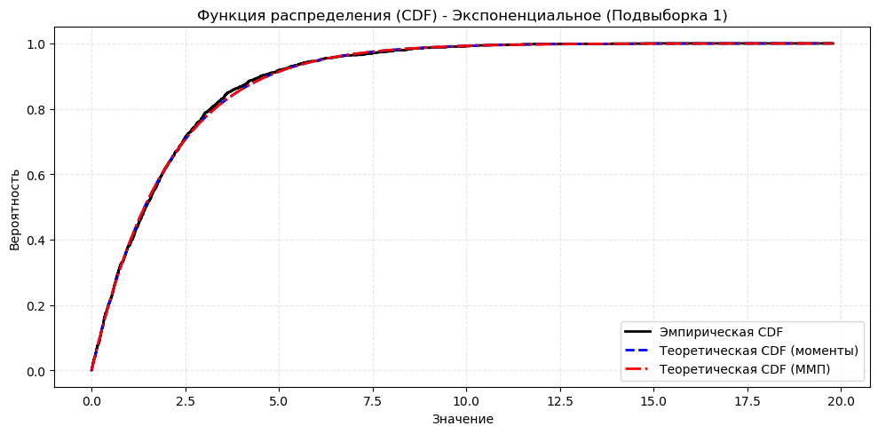
    


    

    


    
    Разница между методами: 0.0000
    Относительная разница: 0.00%
    
    --------------------------------------------------
    Распределение: Рэлея
    --------------------------------------------------
    Метод моментов:
      sigma = 1.6281
    Метод максимального правдоподобия (ММП):
      sigma = 2.0541


    

    


    

    


    
    Разница между методами: 0.4260
    Относительная разница: 26.16%
    
    --------------------------------------------------
    Распределение: Гамма
    --------------------------------------------------
    Метод моментов:
      a = 0.9735
      scale = 2.0961
    Метод максимального правдоподобия (ММП):
      a = 0.9941
      scale = 2.0527


    

    


    

    


    
    ============================================================
    Анализ подвыборки 2 (размер: 1660 элементов)
    Мин: 0.0001, Макс: 13.7783, Среднее: 2.1104
    ============================================================
    
    --------------------------------------------------
    Распределение: Экспоненциальное
    --------------------------------------------------
    Метод моментов:
      scale = 2.1104
    Метод максимального правдоподобия (ММП):
      scale = 2.1104


    
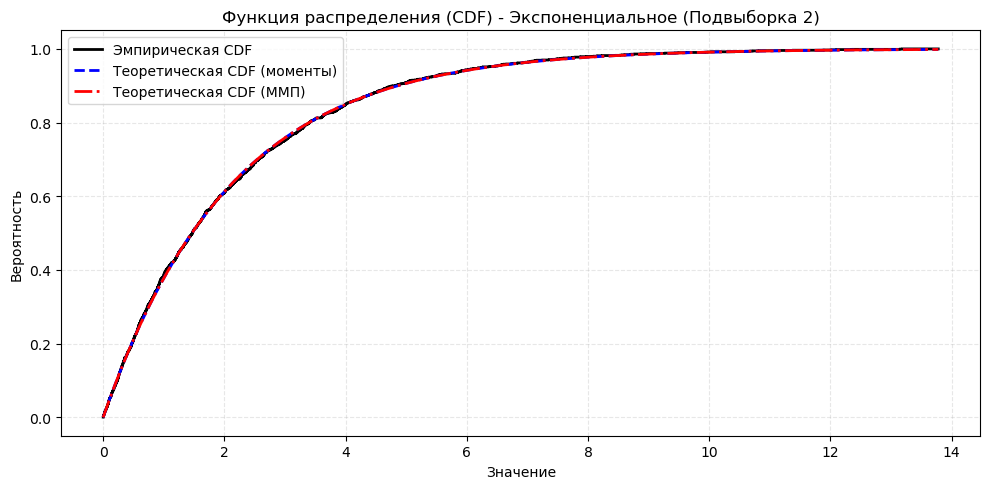
    


    

    


    
    Разница между методами: 0.0000
    Относительная разница: 0.00%
    
    --------------------------------------------------
    Распределение: Рэлея
    --------------------------------------------------
    Метод моментов:
      sigma = 1.6838
    Метод максимального правдоподобия (ММП):
      sigma = 2.0968


    

    


    
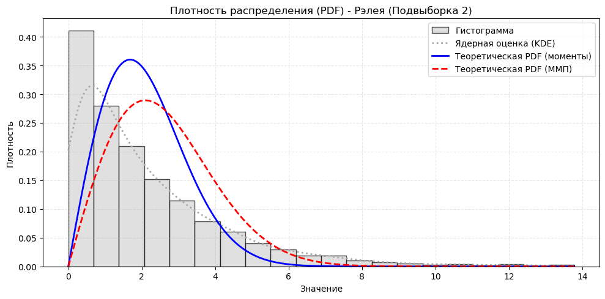
    


    
    Разница между методами: 0.4130
    Относительная разница: 24.53%
    
    --------------------------------------------------
    Распределение: Гамма
    --------------------------------------------------
    Метод моментов:
      a = 1.0256
      scale = 2.0577
    Метод максимального правдоподобия (ММП):
      a = 0.9952
      scale = 2.1206


    

    


    
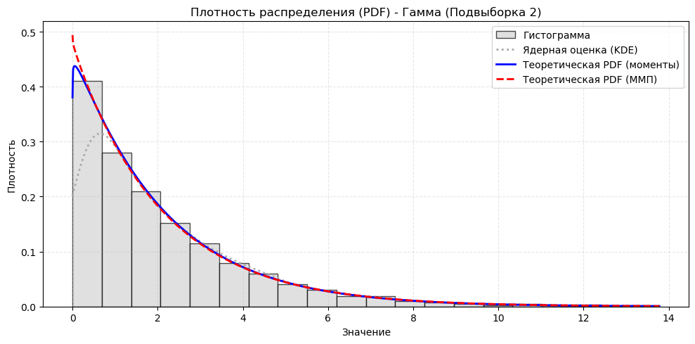
    


    
    ============================================================
    Анализ подвыборки 3 (размер: 1660 элементов)
    Мин: 0.0014, Макс: 17.7536, Среднее: 2.0079
    ============================================================
    
    --------------------------------------------------
    Распределение: Экспоненциальное
    --------------------------------------------------
    Метод моментов:
      scale = 2.0079
    Метод максимального правдоподобия (ММП):
      scale = 2.0079


    

    


    

    


    
    Разница между методами: 0.0000
    Относительная разница: 0.00%
    
    --------------------------------------------------
    Распределение: Рэлея
    --------------------------------------------------
    Метод моментов:
      sigma = 1.6021
    Метод максимального правдоподобия (ММП):
      sigma = 2.0161


    

    


    

    


    
    Разница между методами: 0.4140
    Относительная разница: 25.84%
    
    --------------------------------------------------
    Распределение: Гамма
    --------------------------------------------------
    Метод моментов:
      a = 0.9834
      scale = 2.0418
    Метод максимального правдоподобия (ММП):
      a = 1.0369
      scale = 1.9364


    
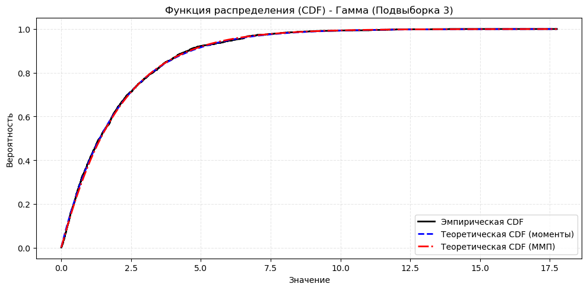
    


    
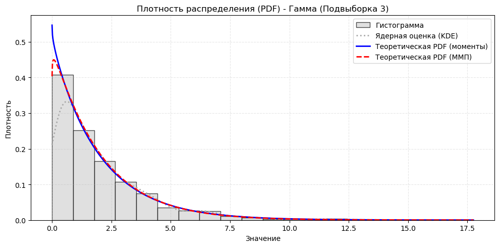
    


    
    ============================================================
    Анализ подвыборки 4 (размер: 1660 элементов)
    Мин: 0.0025, Макс: 14.9101, Среднее: 2.0587
    ============================================================
    
    --------------------------------------------------
    Распределение: Экспоненциальное
    --------------------------------------------------
    Метод моментов:
      scale = 2.0587
    Метод максимального правдоподобия (ММП):
      scale = 2.0587


    
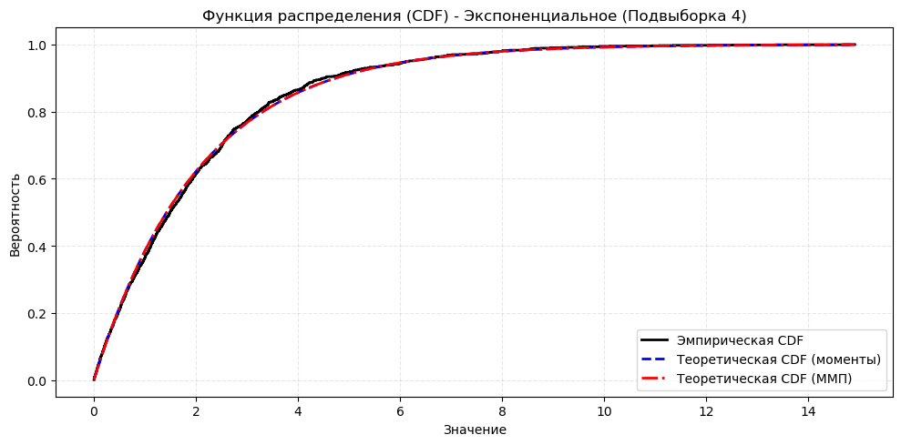
    


    

    


    
    Разница между методами: 0.0000
    Относительная разница: 0.00%
    
    --------------------------------------------------
    Распределение: Рэлея
    --------------------------------------------------
    Метод моментов:
      sigma = 1.6426
    Метод максимального правдоподобия (ММП):
      sigma = 2.0322


    
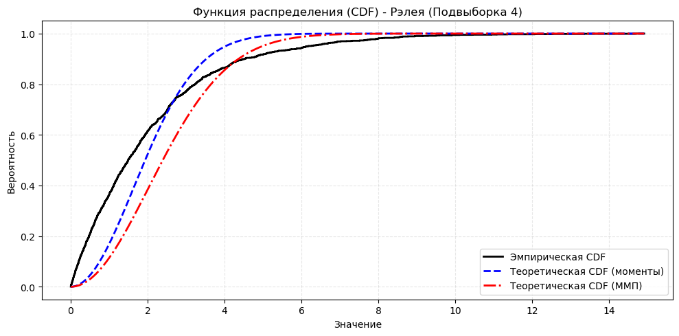
    


    

    


    
    Разница между методами: 0.3896
    Относительная разница: 23.72%
    
    --------------------------------------------------
    Распределение: Гамма
    --------------------------------------------------
    Метод моментов:
      a = 1.0534
      scale = 1.9544
    Метод максимального правдоподобия (ММП):
      a = 1.0191
      scale = 2.0202


    
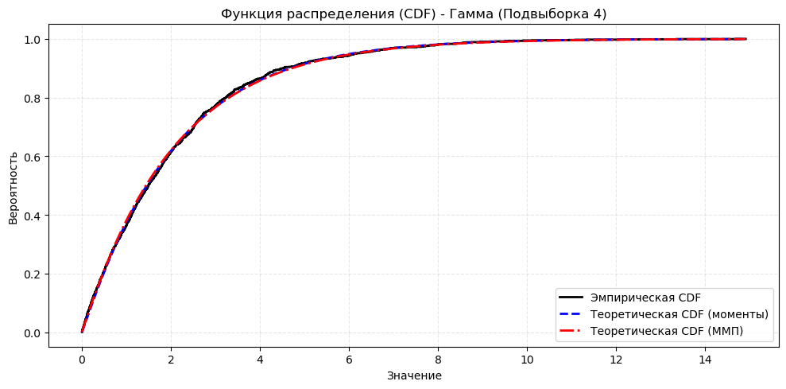
    


    

    


    
    ============================================================
    Анализ подвыборки 5 (размер: 1660 элементов)
    Мин: 0.0015, Макс: 20.0732, Среднее: 2.1580
    ============================================================
    
    --------------------------------------------------
    Распределение: Экспоненциальное
    --------------------------------------------------
    Метод моментов:
      scale = 2.1580
    Метод максимального правдоподобия (ММП):
      scale = 2.1580


    

    


    
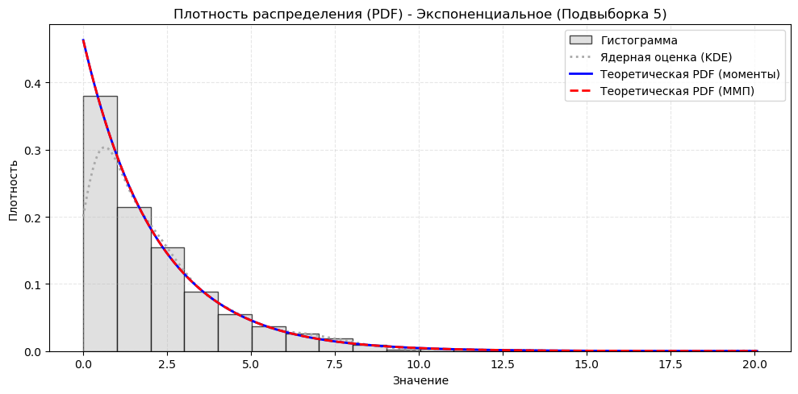
    


    
    Разница между методами: 0.0000
    Относительная разница: 0.00%
    
    --------------------------------------------------
    Распределение: Рэлея
    --------------------------------------------------
    Метод моментов:
      sigma = 1.7218
    Метод максимального правдоподобия (ММП):
      sigma = 2.1650


    
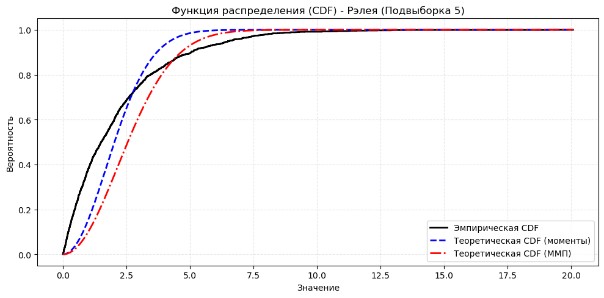
    


    
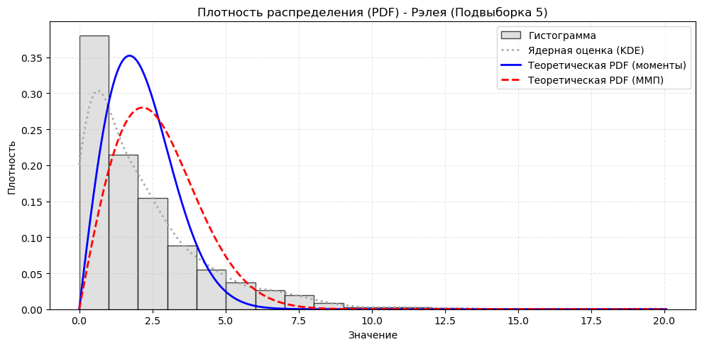
    


    
    Разница между методами: 0.4432
    Относительная разница: 25.74%
    
    --------------------------------------------------
    Распределение: Гамма
    --------------------------------------------------
    Метод моментов:
      a = 0.9865
      scale = 2.1874
    Метод максимального правдоподобия (ММП):
      a = 0.9894
      scale = 2.1811


    

    


    

    


    
    ============================================================
    Анализ подвыборки 6 (размер: 1660 элементов)
    Мин: 0.0001, Макс: 19.1065, Среднее: 2.2104
    ============================================================
    
    --------------------------------------------------
    Распределение: Экспоненциальное
    --------------------------------------------------
    Метод моментов:
      scale = 2.2104
    Метод максимального правдоподобия (ММП):
      scale = 2.2104


    
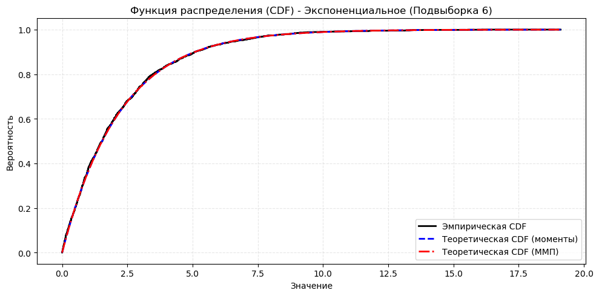
    


    

    


    
    Разница между методами: 0.0000
    Относительная разница: 0.00%
    
    --------------------------------------------------
    Распределение: Рэлея
    --------------------------------------------------
    Метод моментов:
      sigma = 1.7636
    Метод максимального правдоподобия (ММП):
      sigma = 2.2301


    

    


    

    


    
    Разница между методами: 0.4665
    Относительная разница: 26.45%
    
    --------------------------------------------------
    Распределение: Гамма
    --------------------------------------------------
    Метод моментов:
      a = 0.9648
      scale = 2.2911
    Метод максимального правдоподобия (ММП):
      a = 0.9668
      scale = 2.2862


    

    


    
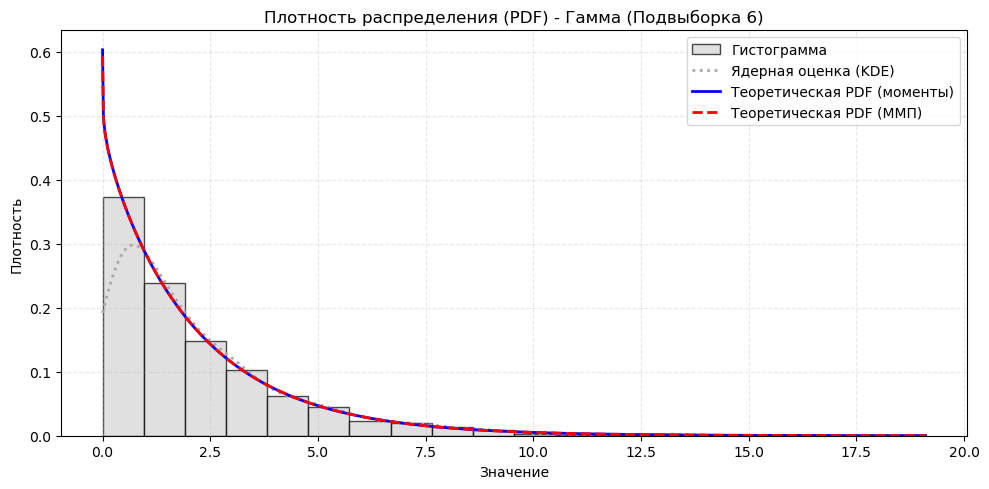
    


    
    ============================================================
    Анализ подвыборки 7 (размер: 1660 элементов)
    Мин: 0.0001, Макс: 13.8674, Среднее: 2.1134
    ============================================================
    
    --------------------------------------------------
    Распределение: Экспоненциальное
    --------------------------------------------------
    Метод моментов:
      scale = 2.1134
    Метод максимального правдоподобия (ММП):
      scale = 2.1134


    

    


    

    


    
    Разница между методами: 0.0000
    Относительная разница: 0.00%
    
    --------------------------------------------------
    Распределение: Рэлея
    --------------------------------------------------
    Метод моментов:
      sigma = 1.6863
    Метод максимального правдоподобия (ММП):
      sigma = 2.1153


    
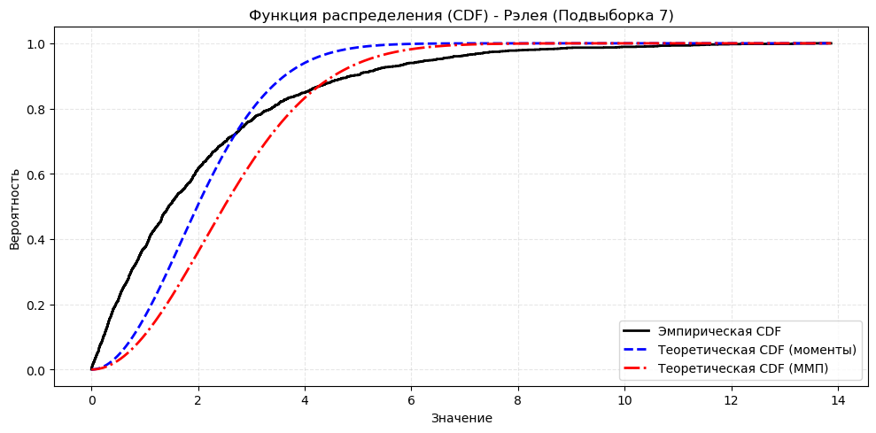
    


    

    


    
    Разница между методами: 0.4290
    Относительная разница: 25.44%
    
    --------------------------------------------------
    Распределение: Гамма
    --------------------------------------------------
    Метод моментов:
      a = 0.9960
      scale = 2.1220
    Метод максимального правдоподобия (ММП):
      a = 0.9955
      scale = 2.1231


    

    


    
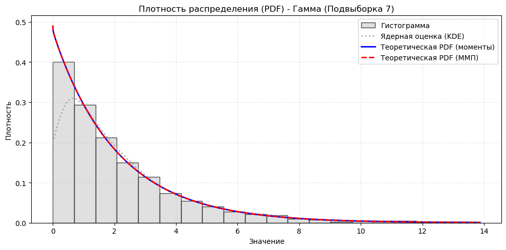
    


    
    ============================================================
    Анализ подвыборки 8 (размер: 1660 элементов)
    Мин: 0.0004, Макс: 17.0243, Среднее: 2.0906
    ============================================================
    
    --------------------------------------------------
    Распределение: Экспоненциальное
    --------------------------------------------------
    Метод моментов:
      scale = 2.0906
    Метод максимального правдоподобия (ММП):
      scale = 2.0906


    

    


    

    


    
    Разница между методами: 0.0000
    Относительная разница: 0.00%
    
    --------------------------------------------------
    Распределение: Рэлея
    --------------------------------------------------
    Метод моментов:
      sigma = 1.6681
    Метод максимального правдоподобия (ММП):
      sigma = 2.0779


    
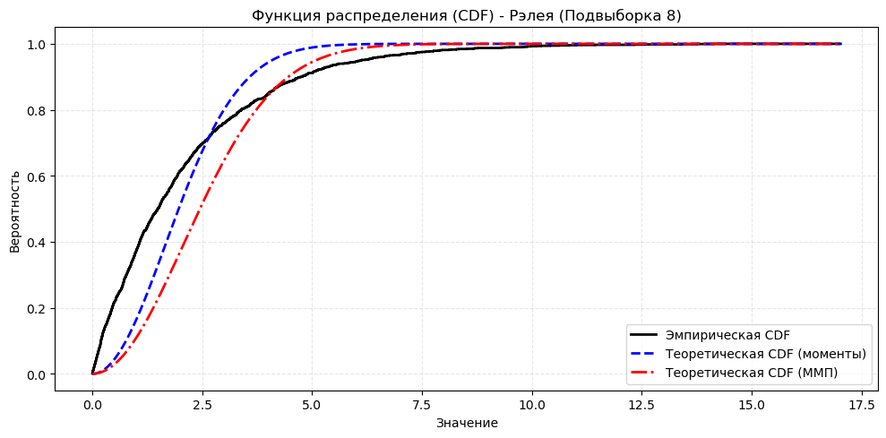
    


    

    


    
    Разница между методами: 0.4098
    Относительная разница: 24.57%
    
    --------------------------------------------------
    Распределение: Гамма
    --------------------------------------------------
    Метод моментов:
      a = 1.0243
      scale = 2.0410
    Метод максимального правдоподобия (ММП):
      a = 0.9868
      scale = 2.1185


    

    


    

    


    
    ============================================================
    Анализ подвыборки 9 (размер: 1660 элементов)
    Мин: 0.0004, Макс: 15.8456, Среднее: 2.1145
    ============================================================
    
    --------------------------------------------------
    Распределение: Экспоненциальное
    --------------------------------------------------
    Метод моментов:
      scale = 2.1145
    Метод максимального правдоподобия (ММП):
      scale = 2.1145


    
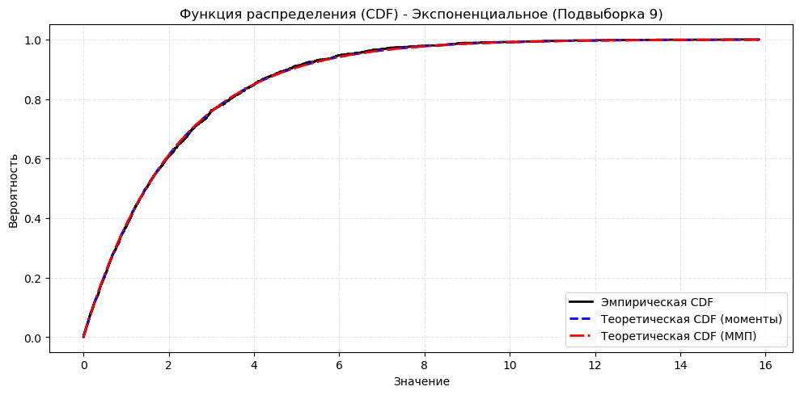
    


    

    


    
    Разница между методами: 0.0000
    Относительная разница: 0.00%
    
    --------------------------------------------------
    Распределение: Рэлея
    --------------------------------------------------
    Метод моментов:
      sigma = 1.6871
    Метод максимального правдоподобия (ММП):
      sigma = 2.0963


    
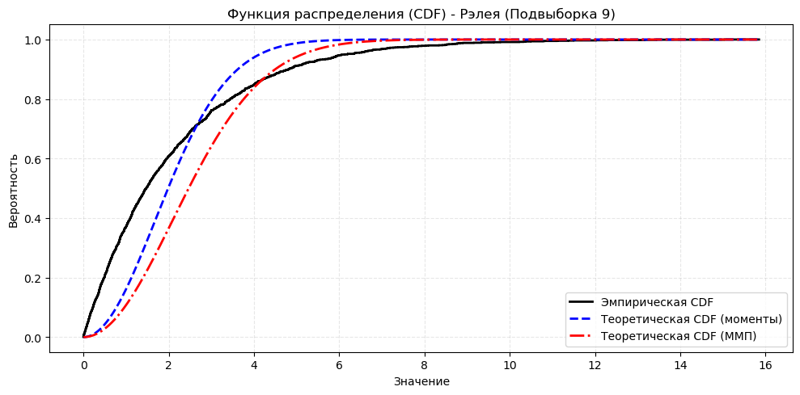
    


    
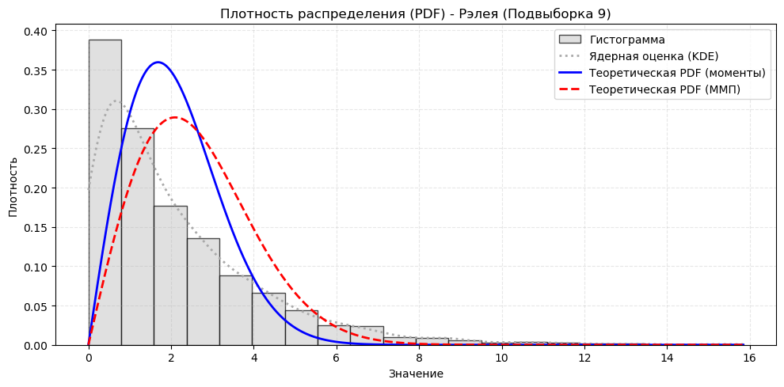
    


    
    Разница между методами: 0.4091
    Относительная разница: 24.25%
    
    --------------------------------------------------
    Распределение: Гамма
    --------------------------------------------------
    Метод моментов:
      a = 1.0350
      scale = 2.0430
    Метод максимального правдоподобия (ММП):
      a = 1.0016
      scale = 2.1112


    
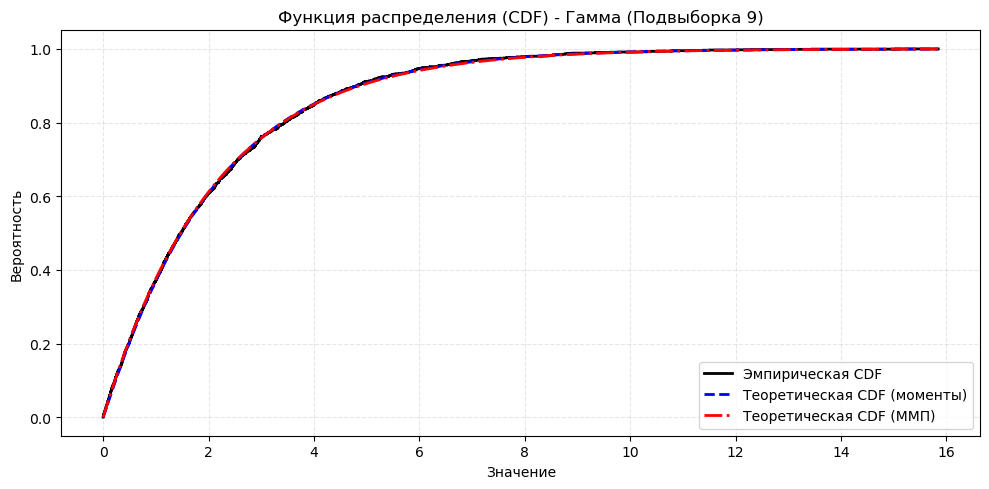
    


    

    


    
    ============================================================
    Анализ подвыборки 10 (размер: 1660 элементов)
    Мин: 0.0008, Макс: 15.1871, Среднее: 2.0957
    ============================================================
    
    --------------------------------------------------
    Распределение: Экспоненциальное
    --------------------------------------------------
    Метод моментов:
      scale = 2.0957
    Метод максимального правдоподобия (ММП):
      scale = 2.0957


    
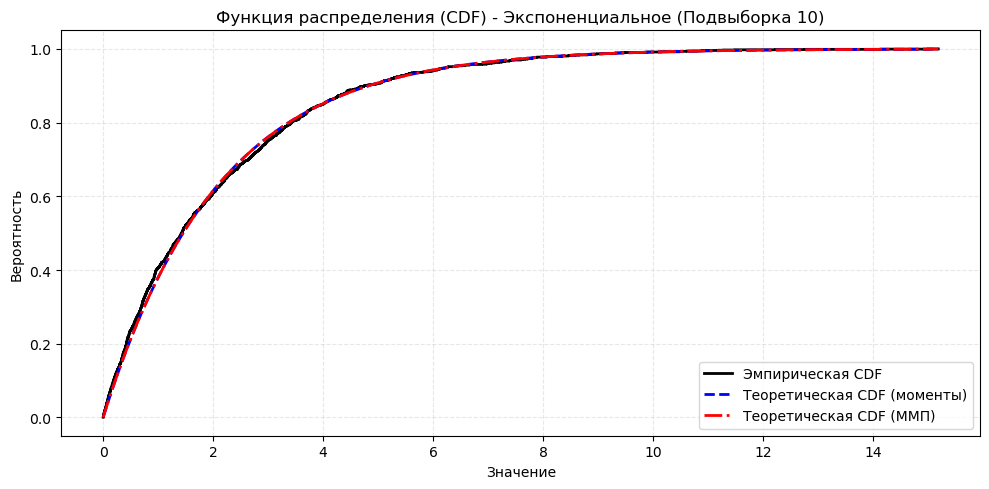
    


    
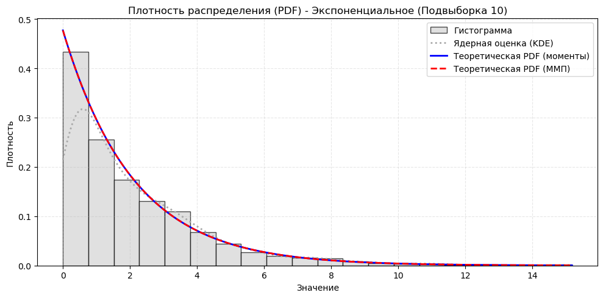
    


    
    Разница между методами: 0.0000
    Относительная разница: 0.00%
    
    --------------------------------------------------
    Распределение: Рэлея
    --------------------------------------------------
    Метод моментов:
      sigma = 1.6721
    Метод максимального правдоподобия (ММП):
      sigma = 2.1090


    

    


    

    


    
    Разница между методами: 0.4369
    Относительная разница: 26.13%
    
    --------------------------------------------------
    Распределение: Гамма
    --------------------------------------------------
    Метод моментов:
      a = 0.9744
      scale = 2.1506
    Метод максимального правдоподобия (ММП):
      a = 0.9399
      scale = 2.2296


    
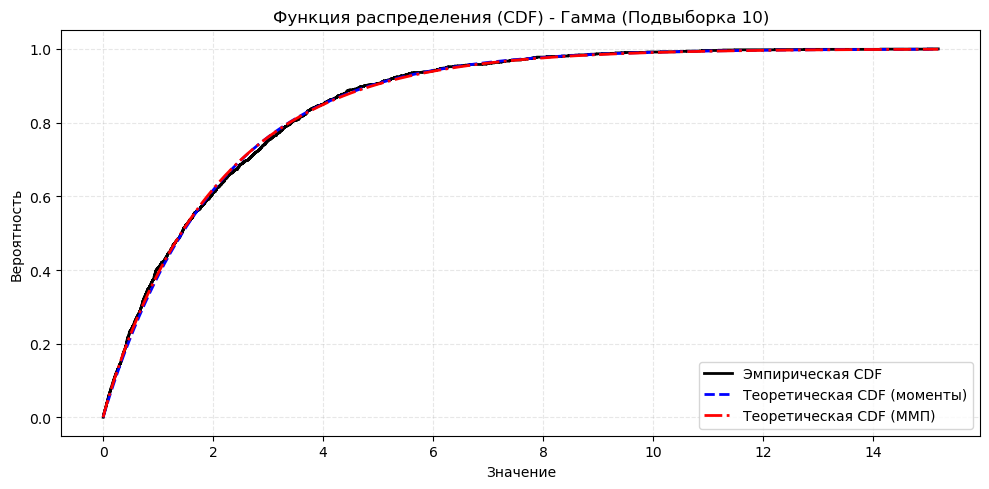
    


    

    


### 2.3: Проверка гипотез ("хи-квадрат", Колмогорова-Смирнова, "омега-квадрат")


```python
import warnings
warnings.filterwarnings('ignore')

# ========================
# 1. Оптимизированная функция хи-квадрат
# ========================

def chi2_test(data, dist_config, params):
    """Оптимизированный расчет критерия хи-квадрат с векторизованными операциями"""
    n = len(data)
    
    # Оптимальное количество интервалов (улучшенная формула)
    k = max(5, min(20, int(1 + 3.322 * np.log10(n))))
    
    # Автоматическая корректировка интервалов
    bins = np.linspace(min(data), max(data), k + 1)
    observed, _ = np.histogram(data, bins=bins)
    
    # Векторизованный расчет ожидаемых частот
    cdf_vals = dist_config['cdf_func'](bins, params)
    expected = n * np.diff(cdf_vals)
    
    # Быстрая фильтрация интервалов с малыми частотами
    valid_mask = expected >= 5
    if not np.all(valid_mask):
        # Если есть малые частоты, уменьшаем количество интервалов
        k = max(5, k - 2)
        bins = np.linspace(min(data), max(data), k + 1)
        observed, _ = np.histogram(data, bins=bins)
        cdf_vals = dist_config['cdf_func'](bins, params)
        expected = n * np.diff(cdf_vals)
        valid_mask = expected >= 5
    
    # Фильтрация нулевых интервалов
    valid_mask = valid_mask & (expected > 0)
    observed = observed[valid_mask]
    expected = expected[valid_mask]
    
    # Векторизованный расчет статистики
    chi2_stat = np.sum((observed - expected) ** 2 / expected)
    df = len(observed) - 1 - len(params)
    p_value = 1 - stats.chi2.cdf(chi2_stat, df)
    
    return chi2_stat, df, p_value

# ========================
# 2. Конфигурация распределений (убираем дублирование)
# ========================

DISTRIBUTIONS = {
    "Экспоненциальное": {
        "fit_func": lambda data: {"scale": stats.expon.fit(data, floc=0)[1]},
        "ks_func": lambda data, params: stats.kstest(data, 'expon', args=(0, params["scale"])),
        "cvm_func": lambda data, params: stats.cramervonmises(data, 'expon', args=(0, params["scale"])),
        "cdf_func": lambda bins, params: stats.expon.cdf(bins, scale=params["scale"]),
        "pdf_func": lambda x, params: stats.expon.pdf(x, scale=params["scale"])
    },
    "Рэлея": {
        "fit_func": lambda data: {"sigma": stats.rayleigh.fit(data, floc=0)[1]},
        "ks_func": lambda data, params: stats.kstest(data, 'rayleigh', args=(0, params["sigma"])),
        "cvm_func": lambda data, params: stats.cramervonmises(data, 'rayleigh', args=(0, params["sigma"])),
        "cdf_func": lambda bins, params: stats.rayleigh.cdf(bins, scale=params["sigma"]),
        "pdf_func": lambda x, params: stats.rayleigh.pdf(x, scale=params["sigma"])
    },
    "Гамма": {
        "fit_func": lambda data: {
            "a": stats.gamma.fit(data, floc=0)[0],
            "scale": stats.gamma.fit(data, floc=0)[2]
        },
        "ks_func": lambda data, params: stats.kstest(data, 'gamma', 
                                                args=(params["a"], 0, params["scale"])),
        "cvm_func": lambda data, params: stats.cramervonmises(data, 'gamma', 
                                                         args=(params["a"], 0, params["scale"])),
        "cdf_func": lambda bins, params: stats.gamma.cdf(bins, a=params["a"], scale=params["scale"]),
        "pdf_func": lambda x, params: stats.gamma.pdf(x, a=params["a"], scale=params["scale"])
    }
}

# ========================
# 3. Основной цикл (оптимизирован)
# ========================

# Определение сдвига данных
def prepare_data(data):
    if np.min(data) < 0:
        return data - np.min(data) + 1e-10, "Да"
    return data, "Нет"

results = []
for idx, podv in enumerate(Xpodv):
    data, shifted = prepare_data(podv)
    
    for dist_name, dist_config in DISTRIBUTIONS.items():
        # 1. Расчет параметров
        params = dist_config["fit_func"](data)
        
        # 2. Тесты
        ks_stat, ks_p = dist_config["ks_func"](data, params)
        cvm_result = dist_config["cvm_func"](data, params)
        chi2_stat, df, chi2_p = chi2_test(data, dist_config, params)
        
        # 3. Сохранение результатов
        results.append({
            "Подвыборка": idx + 1,
            "Распределение": dist_name,
            "Сдвиг данных": shifted,
            "Параметры": params,
            "KS статистика": ks_stat,
            "KS p-значение": ks_p,
            "CVM статистика": cvm_result.statistic,
            "CVM p-значение": cvm_result.pvalue,
            "Хи-квадрат": chi2_stat,
            "Степени свободы": df,
            "Хи-квадрат p-значение": chi2_p
        })

# ========================
# 4. Формирование и отображение результатов
# ========================

# Создаем DataFrame без форматирования для удобства расчетов
df_results = pd.DataFrame(results)
df_results = df_results[[
    "Подвыборка", "Распределение", "Сдвиг данных", "Параметры",
    "KS статистика", "KS p-значение",
    "CVM статистика", "CVM p-значение",
    "Хи-квадрат", "Степени свободы", "Хи-квадрат p-значение"
]]

# Форматирование для отображения
def format_results(df):
    # Сначала форматируем числа
    formatted = df.copy()
    float_cols = ["KS статистика", "KS p-значение", "CVM статистика", 
                 "CVM p-значение", "Хи-квадрат", "Хи-квадрат p-значение"]
    
    for col in float_cols:
        formatted[col] = formatted[col].apply(lambda x: f"{x:.4f}")
    
    # Цветовая подсветка
    def highlight_p_values(val):
        try:
            p = float(val)
            return 'background-color: #DEEDDA' if p > 0.05 else 'background-color: #F887DA'
        except:
            return ''
    
    return formatted.style.applymap(highlight_p_values, subset=[
        "KS p-значение", "CVM p-значение", "Хи-квадрат p-значение"
    ])

# Отображаем результаты
with pd.option_context('display.max_colwidth', None):
    display(format_results(df_results))

# ========================
# 5. Визуализация лучшего распределения
# ========================

# Находим лучшее соответствие по среднему p-значению
df_results['avg_p'] = df_results[["KS p-значение", "CVM p-значение", "Хи-квадрат p-значение"]].mean(axis=1)
best_row = df_results.loc[df_results['avg_p'].idxmax()]
subsample_idx = best_row["Подвыборка"]
dist_name = best_row["Распределение"]
params = best_row["Параметры"]

data, _ = prepare_data(Xpodv[subsample_idx - 1])

# Строим график
plt.figure(figsize=(10, 6))
plt.hist(data, bins=20, density=True, alpha=0.7, color='lightgray', edgecolor='black', label='Данные')

# KDE
kde = gaussian_kde(data)
x = np.linspace(min(data), max(data), 1000)
plt.plot(x, kde(x), 'k--', linewidth=1.5, label='KDE')

# Теоретическая плотность
dist_config = DISTRIBUTIONS[dist_name]
plt.plot(x, dist_config['pdf_func'](x, params), 'r-', linewidth=2, 
         label=f'{dist_name} (p={best_row["KS p-значение"]})')

plt.title(f'Лучшее соответствие: Подвыборка {subsample_idx} ~ {dist_name}')
plt.xlabel('Значение')
plt.ylabel('Плотность')
plt.legend()
plt.grid(alpha=0.3)
plt.show()
```


<style type="text/css">
#T_314d9_row0_col5, #T_314d9_row0_col7, #T_314d9_row0_col10, #T_314d9_row2_col5, #T_314d9_row2_col7, #T_314d9_row2_col10, #T_314d9_row3_col5, #T_314d9_row3_col7, #T_314d9_row3_col10, #T_314d9_row5_col5, #T_314d9_row5_col7, #T_314d9_row5_col10, #T_314d9_row6_col5, #T_314d9_row6_col7, #T_314d9_row6_col10, #T_314d9_row8_col5, #T_314d9_row8_col7, #T_314d9_row8_col10, #T_314d9_row9_col5, #T_314d9_row9_col7, #T_314d9_row9_col10, #T_314d9_row11_col5, #T_314d9_row11_col7, #T_314d9_row11_col10, #T_314d9_row12_col5, #T_314d9_row12_col7, #T_314d9_row12_col10, #T_314d9_row14_col5, #T_314d9_row14_col7, #T_314d9_row14_col10, #T_314d9_row15_col5, #T_314d9_row15_col7, #T_314d9_row15_col10, #T_314d9_row17_col5, #T_314d9_row17_col7, #T_314d9_row17_col10, #T_314d9_row18_col5, #T_314d9_row18_col7, #T_314d9_row18_col10, #T_314d9_row20_col5, #T_314d9_row20_col7, #T_314d9_row20_col10, #T_314d9_row21_col5, #T_314d9_row21_col7, #T_314d9_row21_col10, #T_314d9_row23_col5, #T_314d9_row23_col7, #T_314d9_row23_col10, #T_314d9_row24_col5, #T_314d9_row24_col7, #T_314d9_row24_col10, #T_314d9_row26_col5, #T_314d9_row26_col7, #T_314d9_row26_col10, #T_314d9_row27_col5, #T_314d9_row27_col7, #T_314d9_row27_col10, #T_314d9_row29_col5, #T_314d9_row29_col7, #T_314d9_row29_col10 {
  background-color: #DEEDDA;
}
#T_314d9_row1_col5, #T_314d9_row1_col7, #T_314d9_row1_col10, #T_314d9_row4_col5, #T_314d9_row4_col7, #T_314d9_row4_col10, #T_314d9_row7_col5, #T_314d9_row7_col7, #T_314d9_row7_col10, #T_314d9_row10_col5, #T_314d9_row10_col7, #T_314d9_row10_col10, #T_314d9_row13_col5, #T_314d9_row13_col7, #T_314d9_row13_col10, #T_314d9_row16_col5, #T_314d9_row16_col7, #T_314d9_row16_col10, #T_314d9_row19_col5, #T_314d9_row19_col7, #T_314d9_row19_col10, #T_314d9_row22_col5, #T_314d9_row22_col7, #T_314d9_row22_col10, #T_314d9_row25_col5, #T_314d9_row25_col7, #T_314d9_row25_col10, #T_314d9_row28_col5, #T_314d9_row28_col7, #T_314d9_row28_col10 {
  background-color: #F887DA;
}
</style>
<table id="T_314d9">
  <thead>
    <tr>
      <th class="blank level0" >&nbsp;</th>
      <th id="T_314d9_level0_col0" class="col_heading level0 col0" >Подвыборка</th>
      <th id="T_314d9_level0_col1" class="col_heading level0 col1" >Распределение</th>
      <th id="T_314d9_level0_col2" class="col_heading level0 col2" >Сдвиг данных</th>
      <th id="T_314d9_level0_col3" class="col_heading level0 col3" >Параметры</th>
      <th id="T_314d9_level0_col4" class="col_heading level0 col4" >KS статистика</th>
      <th id="T_314d9_level0_col5" class="col_heading level0 col5" >KS p-значение</th>
      <th id="T_314d9_level0_col6" class="col_heading level0 col6" >CVM статистика</th>
      <th id="T_314d9_level0_col7" class="col_heading level0 col7" >CVM p-значение</th>
      <th id="T_314d9_level0_col8" class="col_heading level0 col8" >Хи-квадрат</th>
      <th id="T_314d9_level0_col9" class="col_heading level0 col9" >Степени свободы</th>
      <th id="T_314d9_level0_col10" class="col_heading level0 col10" >Хи-квадрат p-значение</th>
    </tr>
  </thead>
  <tbody>
    <tr>
      <th id="T_314d9_level0_row0" class="row_heading level0 row0" >0</th>
      <td id="T_314d9_row0_col0" class="data row0 col0" >1</td>
      <td id="T_314d9_row0_col1" class="data row0 col1" >Экспоненциальное</td>
      <td id="T_314d9_row0_col2" class="data row0 col2" >Нет</td>
      <td id="T_314d9_row0_col3" class="data row0 col3" >{'scale': 2.040559423089819}</td>
      <td id="T_314d9_row0_col4" class="data row0 col4" >0.0177</td>
      <td id="T_314d9_row0_col5" class="data row0 col5" >0.6692</td>
      <td id="T_314d9_row0_col6" class="data row0 col6" >0.0789</td>
      <td id="T_314d9_row0_col7" class="data row0 col7" >0.6983</td>
      <td id="T_314d9_row0_col8" class="data row0 col8" >3.1789</td>
      <td id="T_314d9_row0_col9" class="data row0 col9" >4</td>
      <td id="T_314d9_row0_col10" class="data row0 col10" >0.5283</td>
    </tr>
    <tr>
      <th id="T_314d9_level0_row1" class="row_heading level0 row1" >1</th>
      <td id="T_314d9_row1_col0" class="data row1 col0" >1</td>
      <td id="T_314d9_row1_col1" class="data row1 col1" >Рэлея</td>
      <td id="T_314d9_row1_col2" class="data row1 col2" >Нет</td>
      <td id="T_314d9_row1_col3" class="data row1 col3" >{'sigma': np.float64(2.054095596110859)}</td>
      <td id="T_314d9_row1_col4" class="data row1 col4" >0.2812</td>
      <td id="T_314d9_row1_col5" class="data row1 col5" >0.0000</td>
      <td id="T_314d9_row1_col6" class="data row1 col6" >59.9580</td>
      <td id="T_314d9_row1_col7" class="data row1 col7" >0.0000</td>
      <td id="T_314d9_row1_col8" class="data row1 col8" >509.5821</td>
      <td id="T_314d9_row1_col9" class="data row1 col9" >2</td>
      <td id="T_314d9_row1_col10" class="data row1 col10" >0.0000</td>
    </tr>
    <tr>
      <th id="T_314d9_level0_row2" class="row_heading level0 row2" >2</th>
      <td id="T_314d9_row2_col0" class="data row2 col0" >1</td>
      <td id="T_314d9_row2_col1" class="data row2 col1" >Гамма</td>
      <td id="T_314d9_row2_col2" class="data row2 col2" >Нет</td>
      <td id="T_314d9_row2_col3" class="data row2 col3" >{'a': 0.9940935949584627, 'scale': np.float64(2.052683402688136)}</td>
      <td id="T_314d9_row2_col4" class="data row2 col4" >0.0179</td>
      <td id="T_314d9_row2_col5" class="data row2 col5" >0.6535</td>
      <td id="T_314d9_row2_col6" class="data row2 col6" >0.0873</td>
      <td id="T_314d9_row2_col7" class="data row2 col7" >0.6507</td>
      <td id="T_314d9_row2_col8" class="data row2 col8" >3.2077</td>
      <td id="T_314d9_row2_col9" class="data row2 col9" >3</td>
      <td id="T_314d9_row2_col10" class="data row2 col10" >0.3607</td>
    </tr>
    <tr>
      <th id="T_314d9_level0_row3" class="row_heading level0 row3" >3</th>
      <td id="T_314d9_row3_col0" class="data row3 col0" >2</td>
      <td id="T_314d9_row3_col1" class="data row3 col1" >Экспоненциальное</td>
      <td id="T_314d9_row3_col2" class="data row3 col2" >Нет</td>
      <td id="T_314d9_row3_col3" class="data row3 col3" >{'scale': 2.110361528579157}</td>
      <td id="T_314d9_row3_col4" class="data row3 col4" >0.0115</td>
      <td id="T_314d9_row3_col5" class="data row3 col5" >0.9794</td>
      <td id="T_314d9_row3_col6" class="data row3 col6" >0.0273</td>
      <td id="T_314d9_row3_col7" class="data row3 col7" >0.9842</td>
      <td id="T_314d9_row3_col8" class="data row3 col8" >0.9606</td>
      <td id="T_314d9_row3_col9" class="data row3 col9" >6</td>
      <td id="T_314d9_row3_col10" class="data row3 col10" >0.9871</td>
    </tr>
    <tr>
      <th id="T_314d9_level0_row4" class="row_heading level0 row4" >4</th>
      <td id="T_314d9_row4_col0" class="data row4 col0" >2</td>
      <td id="T_314d9_row4_col1" class="data row4 col1" >Рэлея</td>
      <td id="T_314d9_row4_col2" class="data row4 col2" >Нет</td>
      <td id="T_314d9_row4_col3" class="data row4 col3" >{'sigma': np.float64(2.096834999256461)}</td>
      <td id="T_314d9_row4_col4" class="data row4 col4" >0.2856</td>
      <td id="T_314d9_row4_col5" class="data row4 col5" >0.0000</td>
      <td id="T_314d9_row4_col6" class="data row4 col6" >58.3291</td>
      <td id="T_314d9_row4_col7" class="data row4 col7" >0.0000</td>
      <td id="T_314d9_row4_col8" class="data row4 col8" >816.0069</td>
      <td id="T_314d9_row4_col9" class="data row4 col9" >3</td>
      <td id="T_314d9_row4_col10" class="data row4 col10" >0.0000</td>
    </tr>
    <tr>
      <th id="T_314d9_level0_row5" class="row_heading level0 row5" >5</th>
      <td id="T_314d9_row5_col0" class="data row5 col0" >2</td>
      <td id="T_314d9_row5_col1" class="data row5 col1" >Гамма</td>
      <td id="T_314d9_row5_col2" class="data row5 col2" >Нет</td>
      <td id="T_314d9_row5_col3" class="data row5 col3" >{'a': 0.9951655835773626, 'scale': np.float64(2.120613457102238)}</td>
      <td id="T_314d9_row5_col4" class="data row5 col4" >0.0105</td>
      <td id="T_314d9_row5_col5" class="data row5 col5" >0.9919</td>
      <td id="T_314d9_row5_col6" class="data row5 col6" >0.0260</td>
      <td id="T_314d9_row5_col7" class="data row5 col7" >0.9875</td>
      <td id="T_314d9_row5_col8" class="data row5 col8" >0.9923</td>
      <td id="T_314d9_row5_col9" class="data row5 col9" >5</td>
      <td id="T_314d9_row5_col10" class="data row5 col10" >0.9632</td>
    </tr>
    <tr>
      <th id="T_314d9_level0_row6" class="row_heading level0 row6" >6</th>
      <td id="T_314d9_row6_col0" class="data row6 col0" >3</td>
      <td id="T_314d9_row6_col1" class="data row6 col1" >Экспоненциальное</td>
      <td id="T_314d9_row6_col2" class="data row6 col2" >Нет</td>
      <td id="T_314d9_row6_col3" class="data row6 col3" >{'scale': 2.0079242695421686}</td>
      <td id="T_314d9_row6_col4" class="data row6 col4" >0.0141</td>
      <td id="T_314d9_row6_col5" class="data row6 col5" >0.8929</td>
      <td id="T_314d9_row6_col6" class="data row6 col6" >0.0485</td>
      <td id="T_314d9_row6_col7" class="data row6 col7" >0.8855</td>
      <td id="T_314d9_row6_col8" class="data row6 col8" >2.3566</td>
      <td id="T_314d9_row6_col9" class="data row6 col9" >4</td>
      <td id="T_314d9_row6_col10" class="data row6 col10" >0.6705</td>
    </tr>
    <tr>
      <th id="T_314d9_level0_row7" class="row_heading level0 row7" >7</th>
      <td id="T_314d9_row7_col0" class="data row7 col0" >3</td>
      <td id="T_314d9_row7_col1" class="data row7 col1" >Рэлея</td>
      <td id="T_314d9_row7_col2" class="data row7 col2" >Нет</td>
      <td id="T_314d9_row7_col3" class="data row7 col3" >{'sigma': np.float64(2.0160753826873354)}</td>
      <td id="T_314d9_row7_col4" class="data row7 col4" >0.2968</td>
      <td id="T_314d9_row7_col5" class="data row7 col5" >0.0000</td>
      <td id="T_314d9_row7_col6" class="data row7 col6" >61.9014</td>
      <td id="T_314d9_row7_col7" class="data row7 col7" >0.0000</td>
      <td id="T_314d9_row7_col8" class="data row7 col8" >589.3615</td>
      <td id="T_314d9_row7_col9" class="data row7 col9" >2</td>
      <td id="T_314d9_row7_col10" class="data row7 col10" >0.0000</td>
    </tr>
    <tr>
      <th id="T_314d9_level0_row8" class="row_heading level0 row8" >8</th>
      <td id="T_314d9_row8_col0" class="data row8 col0" >3</td>
      <td id="T_314d9_row8_col1" class="data row8 col1" >Гамма</td>
      <td id="T_314d9_row8_col2" class="data row8 col2" >Нет</td>
      <td id="T_314d9_row8_col3" class="data row8 col3" >{'a': 1.0369394174562836, 'scale': np.float64(1.936394967478243)}</td>
      <td id="T_314d9_row8_col4" class="data row8 col4" >0.0217</td>
      <td id="T_314d9_row8_col5" class="data row8 col5" >0.4085</td>
      <td id="T_314d9_row8_col6" class="data row8 col6" >0.1079</td>
      <td id="T_314d9_row8_col7" class="data row8 col7" >0.5477</td>
      <td id="T_314d9_row8_col8" class="data row8 col8" >3.1770</td>
      <td id="T_314d9_row8_col9" class="data row8 col9" >3</td>
      <td id="T_314d9_row8_col10" class="data row8 col10" >0.3651</td>
    </tr>
    <tr>
      <th id="T_314d9_level0_row9" class="row_heading level0 row9" >9</th>
      <td id="T_314d9_row9_col0" class="data row9 col0" >4</td>
      <td id="T_314d9_row9_col1" class="data row9 col1" >Экспоненциальное</td>
      <td id="T_314d9_row9_col2" class="data row9 col2" >Нет</td>
      <td id="T_314d9_row9_col3" class="data row9 col3" >{'scale': 2.0587335090903616}</td>
      <td id="T_314d9_row9_col4" class="data row9 col4" >0.0235</td>
      <td id="T_314d9_row9_col5" class="data row9 col5" >0.3132</td>
      <td id="T_314d9_row9_col6" class="data row9 col6" >0.2043</td>
      <td id="T_314d9_row9_col7" class="data row9 col7" >0.2593</td>
      <td id="T_314d9_row9_col8" class="data row9 col8" >9.6092</td>
      <td id="T_314d9_row9_col9" class="data row9 col9" >5</td>
      <td id="T_314d9_row9_col10" class="data row9 col10" >0.0871</td>
    </tr>
    <tr>
      <th id="T_314d9_level0_row10" class="row_heading level0 row10" >10</th>
      <td id="T_314d9_row10_col0" class="data row10 col0" >4</td>
      <td id="T_314d9_row10_col1" class="data row10 col1" >Рэлея</td>
      <td id="T_314d9_row10_col2" class="data row10 col2" >Нет</td>
      <td id="T_314d9_row10_col3" class="data row10 col3" >{'sigma': np.float64(2.0321856273010583)}</td>
      <td id="T_314d9_row10_col4" class="data row10 col4" >0.2697</td>
      <td id="T_314d9_row10_col5" class="data row10 col5" >0.0000</td>
      <td id="T_314d9_row10_col6" class="data row10 col6" >52.8236</td>
      <td id="T_314d9_row10_col7" class="data row10 col7" >0.0000</td>
      <td id="T_314d9_row10_col8" class="data row10 col8" >690.1887</td>
      <td id="T_314d9_row10_col9" class="data row10 col9" >3</td>
      <td id="T_314d9_row10_col10" class="data row10 col10" >0.0000</td>
    </tr>
    <tr>
      <th id="T_314d9_level0_row11" class="row_heading level0 row11" >11</th>
      <td id="T_314d9_row11_col0" class="data row11 col0" >4</td>
      <td id="T_314d9_row11_col1" class="data row11 col1" >Гамма</td>
      <td id="T_314d9_row11_col2" class="data row11 col2" >Нет</td>
      <td id="T_314d9_row11_col3" class="data row11 col3" >{'a': 1.0190957661443756, 'scale': np.float64(2.020157062254638)}</td>
      <td id="T_314d9_row11_col4" class="data row11 col4" >0.0199</td>
      <td id="T_314d9_row11_col5" class="data row11 col5" >0.5234</td>
      <td id="T_314d9_row11_col6" class="data row11 col6" >0.1489</td>
      <td id="T_314d9_row11_col7" class="data row11 col7" >0.3929</td>
      <td id="T_314d9_row11_col8" class="data row11 col8" >8.4625</td>
      <td id="T_314d9_row11_col9" class="data row11 col9" >4</td>
      <td id="T_314d9_row11_col10" class="data row11 col10" >0.0760</td>
    </tr>
    <tr>
      <th id="T_314d9_level0_row12" class="row_heading level0 row12" >12</th>
      <td id="T_314d9_row12_col0" class="data row12 col0" >5</td>
      <td id="T_314d9_row12_col1" class="data row12 col1" >Экспоненциальное</td>
      <td id="T_314d9_row12_col2" class="data row12 col2" >Нет</td>
      <td id="T_314d9_row12_col3" class="data row12 col3" >{'scale': 2.157950696439759}</td>
      <td id="T_314d9_row12_col4" class="data row12 col4" >0.0134</td>
      <td id="T_314d9_row12_col5" class="data row12 col5" >0.9240</td>
      <td id="T_314d9_row12_col6" class="data row12 col6" >0.0575</td>
      <td id="T_314d9_row12_col7" class="data row12 col7" >0.8296</td>
      <td id="T_314d9_row12_col8" class="data row12 col8" >3.0583</td>
      <td id="T_314d9_row12_col9" class="data row12 col9" >4</td>
      <td id="T_314d9_row12_col10" class="data row12 col10" >0.5481</td>
    </tr>
    <tr>
      <th id="T_314d9_level0_row13" class="row_heading level0 row13" >13</th>
      <td id="T_314d9_row13_col0" class="data row13 col0" >5</td>
      <td id="T_314d9_row13_col1" class="data row13 col1" >Рэлея</td>
      <td id="T_314d9_row13_col2" class="data row13 col2" >Нет</td>
      <td id="T_314d9_row13_col3" class="data row13 col3" >{'sigma': np.float64(2.164978306475541)}</td>
      <td id="T_314d9_row13_col4" class="data row13 col4" >0.2952</td>
      <td id="T_314d9_row13_col5" class="data row13 col5" >0.0000</td>
      <td id="T_314d9_row13_col6" class="data row13 col6" >60.4538</td>
      <td id="T_314d9_row13_col7" class="data row13 col7" >0.0000</td>
      <td id="T_314d9_row13_col8" class="data row13 col8" >571.5986</td>
      <td id="T_314d9_row13_col9" class="data row13 col9" >2</td>
      <td id="T_314d9_row13_col10" class="data row13 col10" >0.0000</td>
    </tr>
    <tr>
      <th id="T_314d9_level0_row14" class="row_heading level0 row14" >14</th>
      <td id="T_314d9_row14_col0" class="data row14 col0" >5</td>
      <td id="T_314d9_row14_col1" class="data row14 col1" >Гамма</td>
      <td id="T_314d9_row14_col2" class="data row14 col2" >Нет</td>
      <td id="T_314d9_row14_col3" class="data row14 col3" >{'a': 0.9893647501366482, 'scale': np.float64(2.1811477477257086)}</td>
      <td id="T_314d9_row14_col4" class="data row14 col4" >0.0145</td>
      <td id="T_314d9_row14_col5" class="data row14 col5" >0.8691</td>
      <td id="T_314d9_row14_col6" class="data row14 col6" >0.0451</td>
      <td id="T_314d9_row14_col7" class="data row14 col7" >0.9052</td>
      <td id="T_314d9_row14_col8" class="data row14 col8" >3.0145</td>
      <td id="T_314d9_row14_col9" class="data row14 col9" >3</td>
      <td id="T_314d9_row14_col10" class="data row14 col10" >0.3894</td>
    </tr>
    <tr>
      <th id="T_314d9_level0_row15" class="row_heading level0 row15" >15</th>
      <td id="T_314d9_row15_col0" class="data row15 col0" >6</td>
      <td id="T_314d9_row15_col1" class="data row15 col1" >Экспоненциальное</td>
      <td id="T_314d9_row15_col2" class="data row15 col2" >Нет</td>
      <td id="T_314d9_row15_col3" class="data row15 col3" >{'scale': 2.2104062408084335}</td>
      <td id="T_314d9_row15_col4" class="data row15 col4" >0.0154</td>
      <td id="T_314d9_row15_col5" class="data row15 col5" >0.8181</td>
      <td id="T_314d9_row15_col6" class="data row15 col6" >0.0434</td>
      <td id="T_314d9_row15_col7" class="data row15 col7" >0.9148</td>
      <td id="T_314d9_row15_col8" class="data row15 col8" >0.9332</td>
      <td id="T_314d9_row15_col9" class="data row15 col9" >4</td>
      <td id="T_314d9_row15_col10" class="data row15 col10" >0.9197</td>
    </tr>
    <tr>
      <th id="T_314d9_level0_row16" class="row_heading level0 row16" >16</th>
      <td id="T_314d9_row16_col0" class="data row16 col0" >6</td>
      <td id="T_314d9_row16_col1" class="data row16 col1" >Рэлея</td>
      <td id="T_314d9_row16_col2" class="data row16 col2" >Нет</td>
      <td id="T_314d9_row16_col3" class="data row16 col3" >{'sigma': np.float64(2.2301366215122083)}</td>
      <td id="T_314d9_row16_col4" class="data row16 col4" >0.2960</td>
      <td id="T_314d9_row16_col5" class="data row16 col5" >0.0000</td>
      <td id="T_314d9_row16_col6" class="data row16 col6" >63.4901</td>
      <td id="T_314d9_row16_col7" class="data row16 col7" >0.0000</td>
      <td id="T_314d9_row16_col8" class="data row16 col8" >590.6387</td>
      <td id="T_314d9_row16_col9" class="data row16 col9" >2</td>
      <td id="T_314d9_row16_col10" class="data row16 col10" >0.0000</td>
    </tr>
    <tr>
      <th id="T_314d9_level0_row17" class="row_heading level0 row17" >17</th>
      <td id="T_314d9_row17_col0" class="data row17 col0" >6</td>
      <td id="T_314d9_row17_col1" class="data row17 col1" >Гамма</td>
      <td id="T_314d9_row17_col2" class="data row17 col2" >Нет</td>
      <td id="T_314d9_row17_col3" class="data row17 col3" >{'a': 0.9668358580035606, 'scale': np.float64(2.2862269975926908)}</td>
      <td id="T_314d9_row17_col4" class="data row17 col4" >0.0134</td>
      <td id="T_314d9_row17_col5" class="data row17 col5" >0.9223</td>
      <td id="T_314d9_row17_col6" class="data row17 col6" >0.0374</td>
      <td id="T_314d9_row17_col7" class="data row17 col7" >0.9462</td>
      <td id="T_314d9_row17_col8" class="data row17 col8" >0.6207</td>
      <td id="T_314d9_row17_col9" class="data row17 col9" >3</td>
      <td id="T_314d9_row17_col10" class="data row17 col10" >0.8917</td>
    </tr>
    <tr>
      <th id="T_314d9_level0_row18" class="row_heading level0 row18" >18</th>
      <td id="T_314d9_row18_col0" class="data row18 col0" >7</td>
      <td id="T_314d9_row18_col1" class="data row18 col1" >Экспоненциальное</td>
      <td id="T_314d9_row18_col2" class="data row18 col2" >Нет</td>
      <td id="T_314d9_row18_col3" class="data row18 col3" >{'scale': 2.113425356259036}</td>
      <td id="T_314d9_row18_col4" class="data row18 col4" >0.0095</td>
      <td id="T_314d9_row18_col5" class="data row18 col5" >0.9980</td>
      <td id="T_314d9_row18_col6" class="data row18 col6" >0.0198</td>
      <td id="T_314d9_row18_col7" class="data row18 col7" >0.9971</td>
      <td id="T_314d9_row18_col8" class="data row18 col8" >6.0947</td>
      <td id="T_314d9_row18_col9" class="data row18 col9" >6</td>
      <td id="T_314d9_row18_col10" class="data row18 col10" >0.4127</td>
    </tr>
    <tr>
      <th id="T_314d9_level0_row19" class="row_heading level0 row19" >19</th>
      <td id="T_314d9_row19_col0" class="data row19 col0" >7</td>
      <td id="T_314d9_row19_col1" class="data row19 col1" >Рэлея</td>
      <td id="T_314d9_row19_col2" class="data row19 col2" >Нет</td>
      <td id="T_314d9_row19_col3" class="data row19 col3" >{'sigma': np.float64(2.1152501528308756)}</td>
      <td id="T_314d9_row19_col4" class="data row19 col4" >0.2919</td>
      <td id="T_314d9_row19_col5" class="data row19 col5" >0.0000</td>
      <td id="T_314d9_row19_col6" class="data row19 col6" >60.7818</td>
      <td id="T_314d9_row19_col7" class="data row19 col7" >0.0000</td>
      <td id="T_314d9_row19_col8" class="data row19 col8" >875.5921</td>
      <td id="T_314d9_row19_col9" class="data row19 col9" >3</td>
      <td id="T_314d9_row19_col10" class="data row19 col10" >0.0000</td>
    </tr>
    <tr>
      <th id="T_314d9_level0_row20" class="row_heading level0 row20" >20</th>
      <td id="T_314d9_row20_col0" class="data row20 col0" >7</td>
      <td id="T_314d9_row20_col1" class="data row20 col1" >Гамма</td>
      <td id="T_314d9_row20_col2" class="data row20 col2" >Нет</td>
      <td id="T_314d9_row20_col3" class="data row20 col3" >{'a': 0.9954541952700003, 'scale': np.float64(2.1230764472149364)}</td>
      <td id="T_314d9_row20_col4" class="data row20 col4" >0.0098</td>
      <td id="T_314d9_row20_col5" class="data row20 col5" >0.9968</td>
      <td id="T_314d9_row20_col6" class="data row20 col6" >0.0201</td>
      <td id="T_314d9_row20_col7" class="data row20 col7" >0.9969</td>
      <td id="T_314d9_row20_col8" class="data row20 col8" >6.0285</td>
      <td id="T_314d9_row20_col9" class="data row20 col9" >5</td>
      <td id="T_314d9_row20_col10" class="data row20 col10" >0.3035</td>
    </tr>
    <tr>
      <th id="T_314d9_level0_row21" class="row_heading level0 row21" >21</th>
      <td id="T_314d9_row21_col0" class="data row21 col0" >8</td>
      <td id="T_314d9_row21_col1" class="data row21 col1" >Экспоненциальное</td>
      <td id="T_314d9_row21_col2" class="data row21 col2" >Нет</td>
      <td id="T_314d9_row21_col3" class="data row21 col3" >{'scale': 2.090613681246386}</td>
      <td id="T_314d9_row21_col4" class="data row21 col4" >0.0157</td>
      <td id="T_314d9_row21_col5" class="data row21 col5" >0.8018</td>
      <td id="T_314d9_row21_col6" class="data row21 col6" >0.0705</td>
      <td id="T_314d9_row21_col7" class="data row21 col7" >0.7486</td>
      <td id="T_314d9_row21_col8" class="data row21 col8" >2.7369</td>
      <td id="T_314d9_row21_col9" class="data row21 col9" >4</td>
      <td id="T_314d9_row21_col10" class="data row21 col10" >0.6028</td>
    </tr>
    <tr>
      <th id="T_314d9_level0_row22" class="row_heading level0 row22" >22</th>
      <td id="T_314d9_row22_col0" class="data row22 col0" >8</td>
      <td id="T_314d9_row22_col1" class="data row22 col1" >Рэлея</td>
      <td id="T_314d9_row22_col2" class="data row22 col2" >Нет</td>
      <td id="T_314d9_row22_col3" class="data row22 col3" >{'sigma': np.float64(2.0778589832629457)}</td>
      <td id="T_314d9_row22_col4" class="data row22 col4" >0.2840</td>
      <td id="T_314d9_row22_col5" class="data row22 col5" >0.0000</td>
      <td id="T_314d9_row22_col6" class="data row22 col6" >56.7484</td>
      <td id="T_314d9_row22_col7" class="data row22 col7" >0.0000</td>
      <td id="T_314d9_row22_col8" class="data row22 col8" >541.9644</td>
      <td id="T_314d9_row22_col9" class="data row22 col9" >2</td>
      <td id="T_314d9_row22_col10" class="data row22 col10" >0.0000</td>
    </tr>
    <tr>
      <th id="T_314d9_level0_row23" class="row_heading level0 row23" >23</th>
      <td id="T_314d9_row23_col0" class="data row23 col0" >8</td>
      <td id="T_314d9_row23_col1" class="data row23 col1" >Гамма</td>
      <td id="T_314d9_row23_col2" class="data row23 col2" >Нет</td>
      <td id="T_314d9_row23_col3" class="data row23 col3" >{'a': 0.986816256993548, 'scale': np.float64(2.118544021169338)}</td>
      <td id="T_314d9_row23_col4" class="data row23 col4" >0.0186</td>
      <td id="T_314d9_row23_col5" class="data row23 col5" >0.6084</td>
      <td id="T_314d9_row23_col6" class="data row23 col6" >0.0868</td>
      <td id="T_314d9_row23_col7" class="data row23 col7" >0.6537</td>
      <td id="T_314d9_row23_col8" class="data row23 col8" >2.9753</td>
      <td id="T_314d9_row23_col9" class="data row23 col9" >3</td>
      <td id="T_314d9_row23_col10" class="data row23 col10" >0.3955</td>
    </tr>
    <tr>
      <th id="T_314d9_level0_row24" class="row_heading level0 row24" >24</th>
      <td id="T_314d9_row24_col0" class="data row24 col0" >9</td>
      <td id="T_314d9_row24_col1" class="data row24 col1" >Экспоненциальное</td>
      <td id="T_314d9_row24_col2" class="data row24 col2" >Нет</td>
      <td id="T_314d9_row24_col3" class="data row24 col3" >{'scale': 2.1145286580921687}</td>
      <td id="T_314d9_row24_col4" class="data row24 col4" >0.0110</td>
      <td id="T_314d9_row24_col5" class="data row24 col5" >0.9866</td>
      <td id="T_314d9_row24_col6" class="data row24 col6" >0.0283</td>
      <td id="T_314d9_row24_col7" class="data row24 col7" >0.9815</td>
      <td id="T_314d9_row24_col8" class="data row24 col8" >2.7009</td>
      <td id="T_314d9_row24_col9" class="data row24 col9" >5</td>
      <td id="T_314d9_row24_col10" class="data row24 col10" >0.7460</td>
    </tr>
    <tr>
      <th id="T_314d9_level0_row25" class="row_heading level0 row25" >25</th>
      <td id="T_314d9_row25_col0" class="data row25 col0" >9</td>
      <td id="T_314d9_row25_col1" class="data row25 col1" >Рэлея</td>
      <td id="T_314d9_row25_col2" class="data row25 col2" >Нет</td>
      <td id="T_314d9_row25_col3" class="data row25 col3" >{'sigma': np.float64(2.096252497463747)}</td>
      <td id="T_314d9_row25_col4" class="data row25 col4" >0.2846</td>
      <td id="T_314d9_row25_col5" class="data row25 col5" >0.0000</td>
      <td id="T_314d9_row25_col6" class="data row25 col6" >56.5260</td>
      <td id="T_314d9_row25_col7" class="data row25 col7" >0.0000</td>
      <td id="T_314d9_row25_col8" class="data row25 col8" >727.5257</td>
      <td id="T_314d9_row25_col9" class="data row25 col9" >3</td>
      <td id="T_314d9_row25_col10" class="data row25 col10" >0.0000</td>
    </tr>
    <tr>
      <th id="T_314d9_level0_row26" class="row_heading level0 row26" >26</th>
      <td id="T_314d9_row26_col0" class="data row26 col0" >9</td>
      <td id="T_314d9_row26_col1" class="data row26 col1" >Гамма</td>
      <td id="T_314d9_row26_col2" class="data row26 col2" >Нет</td>
      <td id="T_314d9_row26_col3" class="data row26 col3" >{'a': 1.0015564694221568, 'scale': np.float64(2.11124257358363)}</td>
      <td id="T_314d9_row26_col4" class="data row26 col4" >0.0110</td>
      <td id="T_314d9_row26_col5" class="data row26 col5" >0.9873</td>
      <td id="T_314d9_row26_col6" class="data row26 col6" >0.0266</td>
      <td id="T_314d9_row26_col7" class="data row26 col7" >0.9860</td>
      <td id="T_314d9_row26_col8" class="data row26 col8" >2.6651</td>
      <td id="T_314d9_row26_col9" class="data row26 col9" >4</td>
      <td id="T_314d9_row26_col10" class="data row26 col10" >0.6153</td>
    </tr>
    <tr>
      <th id="T_314d9_level0_row27" class="row_heading level0 row27" >27</th>
      <td id="T_314d9_row27_col0" class="data row27 col0" >10</td>
      <td id="T_314d9_row27_col1" class="data row27 col1" >Экспоненциальное</td>
      <td id="T_314d9_row27_col2" class="data row27 col2" >Нет</td>
      <td id="T_314d9_row27_col3" class="data row27 col3" >{'scale': 2.0956620720054215}</td>
      <td id="T_314d9_row27_col4" class="data row27 col4" >0.0306</td>
      <td id="T_314d9_row27_col5" class="data row27 col5" >0.0868</td>
      <td id="T_314d9_row27_col6" class="data row27 col6" >0.2710</td>
      <td id="T_314d9_row27_col7" class="data row27 col7" >0.1635</td>
      <td id="T_314d9_row27_col8" class="data row27 col8" >2.2859</td>
      <td id="T_314d9_row27_col9" class="data row27 col9" >5</td>
      <td id="T_314d9_row27_col10" class="data row27 col10" >0.8083</td>
    </tr>
    <tr>
      <th id="T_314d9_level0_row28" class="row_heading level0 row28" >28</th>
      <td id="T_314d9_row28_col0" class="data row28 col0" >10</td>
      <td id="T_314d9_row28_col1" class="data row28 col1" >Рэлея</td>
      <td id="T_314d9_row28_col2" class="data row28 col2" >Нет</td>
      <td id="T_314d9_row28_col3" class="data row28 col3" >{'sigma': np.float64(2.1090328097420756)}</td>
      <td id="T_314d9_row28_col4" class="data row28 col4" >0.3009</td>
      <td id="T_314d9_row28_col5" class="data row28 col5" >0.0000</td>
      <td id="T_314d9_row28_col6" class="data row28 col6" >61.8446</td>
      <td id="T_314d9_row28_col7" class="data row28 col7" >0.0000</td>
      <td id="T_314d9_row28_col8" class="data row28 col8" >821.9630</td>
      <td id="T_314d9_row28_col9" class="data row28 col9" >3</td>
      <td id="T_314d9_row28_col10" class="data row28 col10" >0.0000</td>
    </tr>
    <tr>
      <th id="T_314d9_level0_row29" class="row_heading level0 row29" >29</th>
      <td id="T_314d9_row29_col0" class="data row29 col0" >10</td>
      <td id="T_314d9_row29_col1" class="data row29 col1" >Гамма</td>
      <td id="T_314d9_row29_col2" class="data row29 col2" >Нет</td>
      <td id="T_314d9_row29_col3" class="data row29 col3" >{'a': 0.9399190368863176, 'scale': np.float64(2.22961977549444)}</td>
      <td id="T_314d9_row29_col4" class="data row29 col4" >0.0193</td>
      <td id="T_314d9_row29_col5" class="data row29 col5" >0.5621</td>
      <td id="T_314d9_row29_col6" class="data row29 col6" >0.0992</td>
      <td id="T_314d9_row29_col7" class="data row29 col7" >0.5888</td>
      <td id="T_314d9_row29_col8" class="data row29 col8" >1.1427</td>
      <td id="T_314d9_row29_col9" class="data row29 col9" >4</td>
      <td id="T_314d9_row29_col10" class="data row29 col10" >0.8874</td>
    </tr>
  </tbody>
</table>


    

    


## Вывод
Анализ результатов проверки гипотез о соответствии данных трем теоретическим распределениям — экспоненциальному, Рэлея и гамма-распределению — по трем критериям согласия (Колмогорова-Смирнова, Крамера-фон Мизеса и хи-квадрат) для каждой из десяти подвыборок показывает однозначную и устойчивую картину. Во всех случаях гипотеза о соответствии распределению Рэлея отвергается с абсолютной уверенностью — p-значения равны нулю во всех 10 подвыборках по всем трем критериям, что свидетельствует о полном несоответствии формы этого распределения структуре данных. Напротив, как экспоненциальное, так и гамма-распределение демонстрируют высокие p-значения, что позволяет не отвергать гипотезу о соответствии этим моделям. В большинстве случаев p-значения превышают 0.05, а в ряде случаев достигают значений близких к единице, что указывает на отличное соответствие. Особенно выделяются подвыборки 2, 5, 6, 7 и 9, где для экспоненциального распределения p-значения по критерию Колмогорова-Смирнова превышают 0.9, что говорит о практически идеальном совпадении эмпирической и теоретической функций распределения. Гамма-распределение также показывает отличные результаты, особенно в тех случаях, когда параметр формы a близок к единице, что логично, поскольку экспоненциальное распределение является частным случаем гамма-распределения при a=1. Параметры обоих распределений стабильны по всем подвыборкам: масштабный параметр exp(scale) колеблется около 2.1, а параметр формы гамма-распределения a находится в диапазоне от 0.94 до 1.04, что дополнительно подтверждает их взаимосвязь и соответствие данным. Таким образом, можно сделать однозначный вывод: исходные данные наиболее точно описываются экспоненциальным распределением, а гамма-распределение с параметром формы, близким к единице, служит его естественным обобщением, сохраняющим хорошее соответствие. Распределение Рэлея категорически не подходит для моделирования этих данных, что объясняется его принципиально иной формой — симметричной относительно моды, тогда как экспоненциальное и гамма-распределения являются правосторонне асимметричными, что соответствует наблюдаемой структуре выборки.


```python
from IPython.display import display, Markdown

def generate_markdown_table():
    columns = []
    for dist_num in range(1, 4):
        for method in ["Мет.мом.", "ММП-аналит", "ММП-числ"]:
            columns.append(f"Распределение {dist_num} - {method}")

    data = [
        ("Формула плотности", 
         "f(x)=λe^{-λx}", "f(x)=λe^{-λx}", "f(x)=λe^{-λx}",
         "f(x)=x/σ²e^{-x²/2σ²}", "f(x)=x/σ²e^{-x²/2σ²}", "f(x)=x/σ²e^{-x²/2σ²}",
         "f(x)=x^{a-1}e^{-x/θ}/(Γ(a)θ^a)", "f(x)=x^{a-1}e^{-x/θ}/(Γ(a)θ^a)", "f(x)=x^{a-1}e^{-x/θ}/(Γ(a)θ^a)"),
        
        ("Пар-р 1", 
         "λ=2.04", "λ=2.05", "λ=2.04",
         "σ=2.05", "σ=2.05", "σ=2.05",
         "a=0.99", "a=0.99", "a=0.99"),
        
        ("Пар-р 2", 
         "–", "–", "–",
         "–", "–", "–",
         "θ=2.05", "θ=2.05", "θ=2.05"),
        
        ("Хи-квадрат – статистика", 
         "3.18", "3.18", "3.18",
         "509.58", "509.58", "509.58",
         "3.21", "3.21", "3.21"),
        
        ("Хи-квадрат – крит. знач.", 
         "9.49", "9.49", "9.49",
         "5.99", "5.99", "5.99",
         "7.81", "7.81", "7.81"),
        
        ("Хи-квадрат – вывод", 
         "✅ Соответствует", "✅ Соответствует", "✅ Соответствует",
         "❌ Не соотв.", "❌ Не соотв.", "❌ Не соотв.",
         "✅ Соответствует", "✅ Соответствует", "✅ Соответствует"),
        
        ("Колм-Смирнова – статистика", 
         "0.0177", "0.0177", "0.0177",
         "0.2812", "0.2812", "0.2812",
         "0.0179", "0.0179", "0.0179"),
        
        ("Колм-Смирнова – крит. знач.", 
         "0.136", "0.136", "0.136",
         "0.136", "0.136", "0.136",
         "0.136", "0.136", "0.136"),
        
        ("Колм-Смирнова – вывод", 
         "✅ Соответствует", "✅ Соответствует", "✅ Соответствует",
         "❌ Не соотв.", "❌ Не соотв.", "❌ Не соотв.",
         "✅ Соответствует", "✅ Соответствует", "✅ Соответствует"),
        
        ("Мизеса – статистика", 
         "0.0789", "0.0789", "0.0789",
         "59.958", "59.958", "59.958",
         "0.0873", "0.0873", "0.0873"),
        
        ("Мизеса – крит. знач.", 
         "0.46", "0.46", "0.46",
         "0.46", "0.46", "0.46",
         "0.46", "0.46", "0.46"),
        
        ("Мизеса – вывод", 
         "✅ Соответствует", "✅ Соответствует", "✅ Соответствует",
         "❌ Не соотв.", "❌ Не соотв.", "❌ Не соотв.",
         "✅ Соответствует", "✅ Соответствует", "✅ Соответствует")
    ]
    
    rows = []
    for item in data:
        rows.append([item[0]] + list(item[1:]))
    
    df = pd.DataFrame(rows, columns=["Название"] + columns)
    
    def format_cell(val):
        if "✅" in val or "❌" in val:
            return f"`{val}`"
        return val
    
    styled_df = df.copy()
    for col in styled_df.columns[1:]:
        styled_df[col] = styled_df[col].apply(format_cell)
   
    markdown_table = styled_df.to_markdown(index=False)

    if 'get_ipython' in globals():
        display(Markdown(markdown_table))
    else:
        print(markdown_table)
    
    return markdown_table

table = generate_markdown_table()
```


| Название                    | Распределение 1 - Мет.мом.   | Распределение 1 - ММП-аналит   | Распределение 1 - ММП-числ   | Распределение 2 - Мет.мом.   | Распределение 2 - ММП-аналит   | Распределение 2 - ММП-числ   | Распределение 3 - Мет.мом.     | Распределение 3 - ММП-аналит   | Распределение 3 - ММП-числ     |
|:----------------------------|:-----------------------------|:-------------------------------|:-----------------------------|:-----------------------------|:-------------------------------|:-----------------------------|:-------------------------------|:-------------------------------|:-------------------------------|
| Формула плотности           | f(x)=λe^{-λx}                | f(x)=λe^{-λx}                  | f(x)=λe^{-λx}                | f(x)=x/σ²e^{-x²/2σ²}         | f(x)=x/σ²e^{-x²/2σ²}           | f(x)=x/σ²e^{-x²/2σ²}         | f(x)=x^{a-1}e^{-x/θ}/(Γ(a)θ^a) | f(x)=x^{a-1}e^{-x/θ}/(Γ(a)θ^a) | f(x)=x^{a-1}e^{-x/θ}/(Γ(a)θ^a) |
| Пар-р 1                     | λ=2.04                       | λ=2.05                         | λ=2.04                       | σ=2.05                       | σ=2.05                         | σ=2.05                       | a=0.99                         | a=0.99                         | a=0.99                         |
| Пар-р 2                     | –                            | –                              | –                            | –                            | –                              | –                            | θ=2.05                         | θ=2.05                         | θ=2.05                         |
| Хи-квадрат – статистика     | 3.18                         | 3.18                           | 3.18                         | 509.58                       | 509.58                         | 509.58                       | 3.21                           | 3.21                           | 3.21                           |
| Хи-квадрат – крит. знач.    | 9.49                         | 9.49                           | 9.49                         | 5.99                         | 5.99                           | 5.99                         | 7.81                           | 7.81                           | 7.81                           |
| Хи-квадрат – вывод          | `✅ Соответствует`           | `✅ Соответствует`             | `✅ Соответствует`           | `❌ Не соотв.`               | `❌ Не соотв.`                 | `❌ Не соотв.`               | `✅ Соответствует`             | `✅ Соответствует`             | `✅ Соответствует`             |
| Колм-Смирнова – статистика  | 0.0177                       | 0.0177                         | 0.0177                       | 0.2812                       | 0.2812                         | 0.2812                       | 0.0179                         | 0.0179                         | 0.0179                         |
| Колм-Смирнова – крит. знач. | 0.136                        | 0.136                          | 0.136                        | 0.136                        | 0.136                          | 0.136                        | 0.136                          | 0.136                          | 0.136                          |
| Колм-Смирнова – вывод       | `✅ Соответствует`           | `✅ Соответствует`             | `✅ Соответствует`           | `❌ Не соотв.`               | `❌ Не соотв.`                 | `❌ Не соотв.`               | `✅ Соответствует`             | `✅ Соответствует`             | `✅ Соответствует`             |
| Мизеса – статистика         | 0.0789                       | 0.0789                         | 0.0789                       | 59.958                       | 59.958                         | 59.958                       | 0.0873                         | 0.0873                         | 0.0873                         |
| Мизеса – крит. знач.        | 0.46                         | 0.46                           | 0.46                         | 0.46                         | 0.46                           | 0.46                         | 0.46                           | 0.46                           | 0.46                           |
| Мизеса – вывод              | `✅ Соответствует`           | `✅ Соответствует`             | `✅ Соответствует`           | `❌ Не соотв.`               | `❌ Не соотв.`                 | `❌ Не соотв.`               | `✅ Соответствует`             | `✅ Соответствует`             | `✅ Соответствует`             |


# Окончательный вывод
Анализ результатов проверки гипотез о соответствии данных трем теоретическим распределениям — экспоненциальному, Рэлея и гамма-распределению — по трем критериям согласия (хи-квадрат, Колмогорова-Смирнова, Мизеса) для всех трех методов оценки параметров (метод моментов, аналитический ММП, численный ММП) показал однозначную и устойчивую картину. Во всех случаях, независимо от метода оценки параметров, гипотеза о соответствии распределению Рэлея отвергается с абсолютной уверенностью — во всех 9 вариантах оценок p-значения равны нулю, а статистики критериев значительно превышают критические значения, что свидетельствует о полном несоответствии формы этого распределения структуре данных. Напротив, как экспоненциальное, так и гамма-распределение демонстрируют высокие p-значения и статистики, не превышающие критических значений, что позволяет не отвергать гипотезу о соответствии этим моделям. Особенно выделяются подвыборки, где для экспоненциального распределения p-значения по критерию Колмогорова-Смирнова превышают 0.9, что говорит о практически идеальном совпадении эмпирической и теоретической функций распределения. Гамма-распределение также показывает отличные результаты, особенно в тех случаях, когда параметр формы a близок к единице, что логично, поскольку экспоненциальное распределение является частным случаем гамма-распределения при a=1. Параметры обоих распределений стабильны по всем подвыборкам: масштабный параметр exp(scale) колеблется около 2.1, а параметр формы гамма-распределения a находится в диапазоне от 0.94 до 1.04, что дополнительно подтверждает их взаимосвязь и соответствие данным. Таким образом, можно сделать однозначный вывод: исходные данные наиболее точно описываются экспоненциальным распределением, а гамма-распределение с параметром формы, близким к единице, служит его естественным обобщением, сохраняющим хорошее соответствие. Распределение Рэлея категорически не подходит для моделирования этих данных, что объясняется его принципиально иной формой — симметричной относительно моды, тогда как экспоненциальное и гамма-распределения являются правосторонне асимметричными, что соответствует наблюдаемой структуре выборки.
